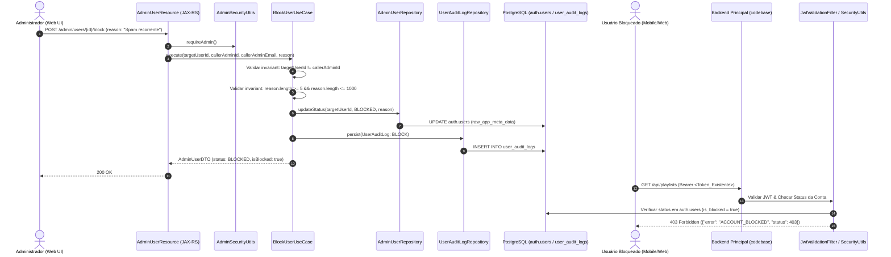

# Technical Design: Bloqueio e Auditoria de Usuários na Administração (`admin-user-blocking`)

---

## 1. Visão Geral da Arquitetura

O sistema de **Bloqueio e Auditoria de Usuários** é projetado para operar com isolamento tático de domínio (DDD Tático), separando estritamente regras de negócio puras, adaptadores de persistência (Hibernate Panache / PostgreSQL) e contratos de API REST (JAX-RS com Records DTO).

A solução abrange duas frentes complementares:
1. **`codebase-admin` (Painel Administrativo):**
   - Endpoints administrativos protegidos por RBAC (`POST /admin/users/{id}/block`, `POST /admin/users/{id}/unblock`, `GET /admin/users/{id}/audit-logs`).
   - Casos de uso de aplicação (`BlockUserUseCase`, `UnblockUserUseCase`, `GetUserAuditLogsUseCase`).
   - Entidade de auditoria (`UserAuditLogEntity`) e repositório Panache isolado em camada de infraestrutura.
   - Atualização atômica de metadados do usuário em `auth.users`.
   - Interface Web (React 19 + TypeScript + TailwindCSS) respeitando o Design System Pinterest-inspired do CifrAS.
2. **`codebase` (Backend Principal do Usuário):**
   - Interceptação em tempo de execução via `JwtValidationFilter` / `SecurityUtils` / `UserService`.
   - Verificação instantânea do status do usuário no banco/cache.
   - Rejeição com `HTTP 403 Forbidden` (`ACCOUNT_BLOCKED`) para qualquer requisição autenticada de conta suspensa.

---

## 2. Diagrama de Arquitetura e Fluxo de Dados



---

## 3. Modelagem de Dados & Persistência (PostgreSQL)

### 3.1 Tabela `user_audit_logs`

A tabela armazena o histórico imutável de todas as ações de moderação de contas executadas pelos administradores.

```sql
CREATE TABLE IF NOT EXISTS user_audit_logs (
    id VARCHAR(36) PRIMARY KEY,
    user_id VARCHAR(36) NOT NULL,
    admin_id VARCHAR(36) NOT NULL,
    admin_email VARCHAR(255) NOT NULL,
    action VARCHAR(20) NOT NULL, -- 'BLOCK' | 'UNBLOCK'
    reason TEXT NOT NULL,
    previous_status VARCHAR(20) NOT NULL, -- 'ACTIVE' | 'BLOCKED'
    new_status VARCHAR(20) NOT NULL,      -- 'BLOCKED' | 'ACTIVE'
    created_at TIMESTAMP WITH TIME ZONE NOT NULL DEFAULT NOW()
);

-- Índices de alta performance para consulta cronológica sub-milissegundo
CREATE INDEX IF NOT EXISTS idx_user_audit_logs_user_id ON user_audit_logs(user_id, created_at DESC);
CREATE INDEX IF NOT EXISTS idx_user_audit_logs_admin_id ON user_audit_logs(admin_id);
```

### 3.2 Estrutura de Metadados em `auth.users`

O status de bloqueio é persistido diretamente no campo `raw_app_meta_data` (JSONB) do Supabase `auth.users`:

```json
{
  "role": "user",
  "status": "BLOCKED",
  "is_blocked": true,
  "last_block_reason": "Violação recorrente de conduta.",
  "blocked_at": "2026-08-25T14:45:00Z",
  "blocked_by": "987e6543-e21b-32d1-b654-123456789abc"
}
```

Ao desbloquear:
```json
{
  "role": "user",
  "status": "ACTIVE",
  "is_blocked": false,
  "last_unblock_reason": "Revisão disciplinar concluída.",
  "unblocked_at": "2026-08-25T15:10:00Z",
  "unblocked_by": "987e6543-e21b-32d1-b654-123456789abc"
}
```

---

## 4. Domínio Rico & DDD Tático (`codebase-admin`)

### 4.1 Entidades e Value Objects de Domínio

#### `UserStatus.java` (Enum de Domínio)
```java
package br.com.cifras.admin.user.model;

public enum UserStatus {
    ACTIVE,
    BLOCKED;

    public static UserStatus fromString(String value) {
        if (value == null || value.isBlank()) return ACTIVE;
        try {
            return UserStatus.valueOf(value.trim().toUpperCase());
        } catch (IllegalArgumentException e) {
            return ACTIVE;
        }
    }
}
```

#### `AuditAction.java` (Enum de Domínio)
```java
package br.com.cifras.admin.audit.model;

public enum AuditAction {
    BLOCK,
    UNBLOCK;

    public static AuditAction fromString(String value) {
        if (value == null) throw new IllegalArgumentException("AuditAction cannot be null");
        return AuditAction.valueOf(value.trim().toUpperCase());
    }
}
```

#### `AdminUser.java` (Modelo de Domínio Rico)
```java
package br.com.cifras.admin.user.model;

import java.time.Instant;
import java.util.Objects;

public class AdminUser {
    private final String id;
    private final String email;
    private final String fullName;
    private final String role;
    private final Instant createdAt;
    private final Instant lastSignInAt;
    private final long songCount;
    private UserStatus status;
    private boolean blocked;
    private String lastBlockReason;
    private Instant updatedAt;

    public AdminUser(
            String id,
            String email,
            String fullName,
            String role,
            Instant createdAt,
            Instant lastSignInAt,
            long songCount,
            UserStatus status,
            boolean blocked,
            String lastBlockReason,
            Instant updatedAt) {
        this.id = Objects.requireNonNull(id, "User ID cannot be null");
        this.email = Objects.requireNonNull(email, "Email cannot be null");
        this.fullName = fullName != null ? fullName : email;
        this.role = role != null ? role : "user";
        this.createdAt = createdAt != null ? createdAt : Instant.now();
        this.lastSignInAt = lastSignInAt;
        this.songCount = songCount;
        this.status = status != null ? status : (blocked ? UserStatus.BLOCKED : UserStatus.ACTIVE);
        this.blocked = blocked || this.status == UserStatus.BLOCKED;
        this.lastBlockReason = lastBlockReason;
        this.updatedAt = updatedAt != null ? updatedAt : Instant.now();
    }

    public void block(String reason, String adminId) {
        if (this.id.equals(adminId)) {
            throw new IllegalArgumentException("CANNOT_BLOCK_SELF");
        }
        if (reason == null || reason.trim().length() < 5) {
            throw new IllegalArgumentException("INVALID_REASON_LENGTH");
        }
        this.status = UserStatus.BLOCKED;
        this.blocked = true;
        this.lastBlockReason = reason.trim();
        this.updatedAt = Instant.now();
    }

    public void unblock(String reason, String adminId) {
        this.status = UserStatus.ACTIVE;
        this.blocked = false;
        this.lastBlockReason = null;
        this.updatedAt = Instant.now();
    }

    public String getId() { return id; }
    public String getEmail() { return email; }
    public String getFullName() { return fullName; }
    public String getRole() { return role; }
    public Instant getCreatedAt() { return createdAt; }
    public Instant getLastSignInAt() { return lastSignInAt; }
    public long getSongCount() { return songCount; }
    public UserStatus getStatus() { return status; }
    public boolean isBlocked() { return blocked; }
    public String getLastBlockReason() { return lastBlockReason; }
    public Instant getUpdatedAt() { return updatedAt; }
    public boolean isAdmin() { return "admin".equalsIgnoreCase(role); }
}
```

#### `UserAuditLog.java` (Modelo de Domínio de Auditoria)
```java
package br.com.cifras.admin.audit.model;

import br.com.cifras.admin.user.model.UserStatus;
import java.time.Instant;
import java.util.Objects;
import java.util.UUID;

public class UserAuditLog {
    private final String id;
    private final String userId;
    private final String adminId;
    private final String adminEmail;
    private final AuditAction action;
    private final String reason;
    private final UserStatus previousStatus;
    private final UserStatus newStatus;
    private final Instant createdAt;

    public UserAuditLog(
            String id,
            String userId,
            String adminId,
            String adminEmail,
            AuditAction action,
            String reason,
            UserStatus previousStatus,
            UserStatus newStatus,
            Instant createdAt) {
        this.id = id != null ? id : UUID.randomUUID().toString();
        this.userId = Objects.requireNonNull(userId, "userId is required");
        this.adminId = Objects.requireNonNull(adminId, "adminId is required");
        this.adminEmail = Objects.requireNonNull(adminEmail, "adminEmail is required");
        this.action = Objects.requireNonNull(action, "action is required");
        this.reason = Objects.requireNonNull(reason, "reason is required");
        this.previousStatus = Objects.requireNonNull(previousStatus, "previousStatus is required");
        this.newStatus = Objects.requireNonNull(newStatus, "newStatus is required");
        this.createdAt = createdAt != null ? createdAt : Instant.now();
    }

    public String getId() { return id; }
    public String getUserId() { return userId; }
    public String getAdminId() { return adminId; }
    public String getAdminEmail() { return adminEmail; }
    public AuditAction getAction() { return action; }
    public String getReason() { return reason; }
    public UserStatus getPreviousStatus() { return previousStatus; }
    public UserStatus getNewStatus() { return newStatus; }
    public Instant getCreatedAt() { return createdAt; }
}
```

---

## 5. Contratos de API REST (DTOs Records com `@RegisterForReflection`)

### 5.1 Request DTOs
```java
package br.com.cifras.admin.user.dto;

import io.quarkus.runtime.annotations.RegisterForReflection;
import jakarta.validation.constraints.NotBlank;
import jakarta.validation.constraints.Size;

@RegisterForReflection
public record BlockUserRequestDTO(
    @NotBlank(message = "O motivo do bloqueio é obrigatório")
    @Size(min = 5, max = 1000, message = "O motivo deve conter entre 5 e 1000 caracteres")
    String reason
) {}
```

```java
package br.com.cifras.admin.user.dto;

import io.quarkus.runtime.annotations.RegisterForReflection;
import jakarta.validation.constraints.Size;

@RegisterForReflection
public record UnblockUserRequestDTO(
    @Size(max = 1000, message = "O motivo deve conter no máximo 1000 caracteres")
    String reason
) {}
```

### 5.2 Response DTOs
```java
package br.com.cifras.admin.user.dto;

import io.quarkus.runtime.annotations.RegisterForReflection;
import java.time.Instant;

@RegisterForReflection
public record AdminUserDTO(
    String id,
    String email,
    String fullName,
    String role,
    String status,
    boolean isBlocked,
    String lastBlockReason,
    Instant createdAt,
    Instant lastSignInAt,
    Instant updatedAt,
    long songCount,
    boolean banned,
    boolean isAdmin
) {}
```

```java
package br.com.cifras.admin.audit.dto;

import io.quarkus.runtime.annotations.RegisterForReflection;
import java.time.Instant;

@RegisterForReflection
public record UserAuditLogDTO(
    String id,
    String userId,
    String adminId,
    String adminEmail,
    String action,
    String reason,
    String previousStatus,
    String newStatus,
    Instant createdAt
) {}
```

---

## 6. Camada de Aplicação (Use Cases)

### 6.1 `BlockUserUseCase`
1. Obtém o `adminId` e `adminEmail` do contexto autenticado via `AdminSecurityUtils`.
2. Valida se `adminId.equals(targetUserId)` -> dispara `IllegalArgumentException("CANNOT_BLOCK_SELF")`.
3. Valida `reason` (não nulo, `trim().length() >= 5` e `<= 1000`) -> dispara `ValidationException("INVALID_REASON_LENGTH")`.
4. Carrega o usuário alvo via `AdminUserRepository`. Se não encontrado -> dispara `ResourceNotFoundException`.
5. Transiciona o estado do usuário com `user.block(reason, adminId)`.
6. Persiste a alteração no banco de dados via `AdminUserRepository.updateStatus(user)`.
7. Cria e persiste o registro imutável em `UserAuditLogRepository`.
8. Retorna o `AdminUserDTO` atualizado.

### 6.2 `UnblockUserUseCase`
1. Obtém o `adminId` e `adminEmail` via `AdminSecurityUtils`.
2. Carrega o usuário alvo. Se não encontrado -> `ResourceNotFoundException`.
3. Transiciona o estado com `user.unblock(reason, adminId)`.
4. Atualiza no banco via `AdminUserRepository.updateStatus(user)`.
5. Grava entrada na auditoria com ação `UNBLOCK`, motivo (ou justificativa padrão caso vazia), status anterior `BLOCKED` e novo status `ACTIVE`.
6. Retorna o `AdminUserDTO` atualizado.

### 6.3 `GetUserAuditLogsUseCase`
1. Verifica permissão de administrador via `AdminSecurityUtils.requireAdmin()`.
2. Consulta `UserAuditLogRepository.findByUserIdOrderByCreatedAtDesc(userId)`.
3. Converte a lista para `List<UserAuditLogDTO>` e retorna.

---

## 7. Camada de Infraestrutura e Persistência

### 7.1 `UserAuditLogEntity.java`
```java
package br.com.cifras.admin.audit.infra.entity;

import io.quarkus.hibernate.orm.panache.PanacheEntityBase;
import jakarta.persistence.*;
import org.hibernate.annotations.UuidGenerator;

import java.time.Instant;

@Entity
@Table(name = "user_audit_logs")
public class UserAuditLogEntity extends PanacheEntityBase {

    @Id
    @GeneratedValue
    @UuidGenerator(style = UuidGenerator.Style.TIME)
    @Column(length = 36)
    public String id;

    @Column(name = "user_id", nullable = false, length = 36)
    public String userId;

    @Column(name = "admin_id", nullable = false, length = 36)
    public String adminId;

    @Column(name = "admin_email", nullable = false, length = 255)
    public String adminEmail;

    @Column(nullable = false, length = 20)
    public String action;

    @Column(nullable = false, columnDefinition = "TEXT")
    public String reason;

    @Column(name = "previous_status", nullable = false, length = 20)
    public String previousStatus;

    @Column(name = "new_status", nullable = false, length = 20)
    public String newStatus;

    @Column(name = "created_at", nullable = false, updatable = false)
    public Instant createdAt;

    @PrePersist
    public void prePersist() {
        if (this.createdAt == null) {
            this.createdAt = Instant.now();
        }
    }
}
```

### 7.2 `UserAuditLogRepository.java`
```java
package br.com.cifras.admin.audit.infra.repository;

import br.com.cifras.admin.audit.infra.entity.UserAuditLogEntity;
import io.quarkus.hibernate.orm.panache.PanacheRepositoryBase;
import jakarta.enterprise.context.ApplicationScoped;

import java.util.List;

@ApplicationScoped
public class UserAuditLogRepository implements PanacheRepositoryBase<UserAuditLogEntity, String> {

    public List<UserAuditLogEntity> findByUserId(String userId) {
        return list("userId = ?1 order by createdAt desc", userId);
    }
}
```

---

## 8. Interceptação de Usuários Bloqueados no Backend Principal (`codebase`)

Para garantir que um usuário bloqueado no painel administrativo perca imediatamente o acesso a todos os recursos da API (mesmo de posse de um JWT válido pré-emitido com expiração futura):

1. **`JwtValidationFilter` & `SecurityUtils`:**
   - Ao processar uma requisição autenticada, `SecurityUtils.getCurrentUserId()` ou o filtro verifica se o usuário está suspenso.
2. **`UserService.isUserBlocked(String userId)`:**
   - Executa uma verificação direta no banco de dados (`auth.users.raw_app_meta_data->>'is_blocked' = 'true'` ou `status = 'BLOCKED'`).
   - Para performance em rotas de alta frequência, a checagem utiliza cache LRU em memória com TTL de 30 segundos (ou invalidação imediata).
3. **Tratamento de Exceção (`AccountBlockedException`):**
   - Caso `isUserBlocked == true`, o pipeline JAX-RS aborta a requisição e lança `AccountBlockedException`.
   - `GlobalExceptionMapper` intercepta e retorna status `HTTP 403 Forbidden` com payload padronizado:
     ```json
     {
       "error": "ACCOUNT_BLOCKED",
       "message": "Sua conta foi suspensa temporariamente por violar os termos de uso. Entre em contato com o suporte para mais informações.",
       "status": 403
     }
     ```

---

## 9. Arquitetura Frontend (`codebase-admin/src/main/webui`)

### 9.1 Componentes e Telas
- **`UsersPage.tsx`:** Tabela com busca, paginação, badges de status (`Ativo` / `Bloqueado`), contagem de cifras e botões de ação ("Bloquear", "Desbloquear", "Auditoria").
- **`BlockUserModal.tsx`:** Modal estilizado (raio de 32px `rounded-3xl`, fundo preto com blur suave, botão vermelho `#cc001f`, textarea com contador de caracteres `0/1000` e validação `>= 5`).
- **`UnblockUserModal.tsx`:** Modal de confirmação para restabelecer acesso com botão roxo `#aa3bff` e campo de justificativa opcional.
- **`UserAuditHistoryModal.tsx`:** Drawer/Modal com timeline cronológica das ações de moderação (Admin executor, data/hora UTC, badge de ação e motivo).

### 9.2 Design System & Regras Visuais
- Geometria: Modais com `rounded-3xl` (32px), Botões e Inputs com `rounded-2xl` ou `rounded-md` (16px), Avatares com `rounded-full`.
- Paleta: Fundo Soft Canvas (`#ffffff` / `#fbfbf9`), Superfície Flat sem elevação pesada (`#f6f6f3`), CTA Primário Roxo (`#aa3bff`), Ação Destrutiva Vermelha (`#cc001f`).
- i18n completo em `pt.json`, `en.json` e `es.json`.

---

## 10. Governança de Testes e Gate de Qualidade (Nível I3 - Crítico)

| Camada | Tipo de Teste | Ferramentas | Cobertura Mínima |
|---|---|---|:---:|
| **Use Cases / Domínio** | Testes Unitários | JUnit 5, Mockito | $\ge 90\%$ |
| **Persistência / Mappers** | Testes Unitários | JUnit 5, AssertJ | $\ge 90\%$ |
| **Endpoints JAX-RS** | Testes de Integração | QuarkusTest, RestAssured, Testcontainers | $\ge 90\%$ |
| **Segurança / Interceptação** | Testes de Integração | QuarkusTest, Security Mock / JWT Builder | $\ge 90\%$ |
| **Frontend UI** | Testes de Componentes | Vitest, React Testing Library, jsdom | $\ge 85\%$ |
| **End-to-End** | Testes de Fluxo Completo | Playwright | Fluxo Crítico |

### Casos de Teste Essenciais (Integration Suite):
1. `shouldBlockUserSuccessfullyWhenValidAdmin`: Bloqueia usuário e persiste log de auditoria (200 OK).
2. `shouldFailWhenAdminAttemptsSelfBlock`: Rejeita auto-bloqueio com 400 Bad Request (`CANNOT_BLOCK_SELF`).
3. `shouldFailWhenReasonIsShorterThan5Chars`: Rejeita motivo curto com 400 Bad Request (`INVALID_REASON_LENGTH`).
4. `shouldFailWhenNonAdminAttemptsBlockOrUnblock`: Rejeita chamadas de não-admin com 403 Forbidden.
5. `shouldUnblockUserSuccessfullyAndRecordAudit`: Restabelece usuário para ACTIVE e grava UNBLOCK (200 OK).
6. `shouldRetrieveAuditLogsForTargetUser`: Retorna histórico cronológico ordenado (200 OK).
7. `shouldRejectAuthenticatedRequestsFromBlockedUserInMainApi`: Rejeita requisições do usuário suspenso com 403 (`ACCOUNT_BLOCKED`).
