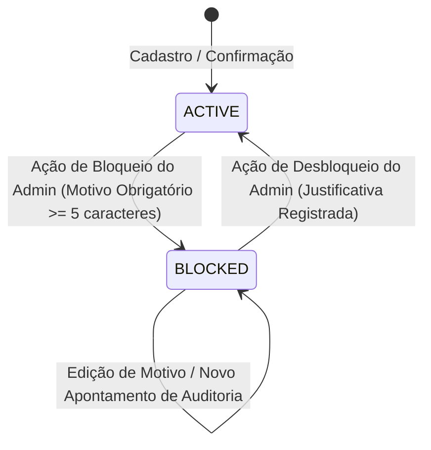
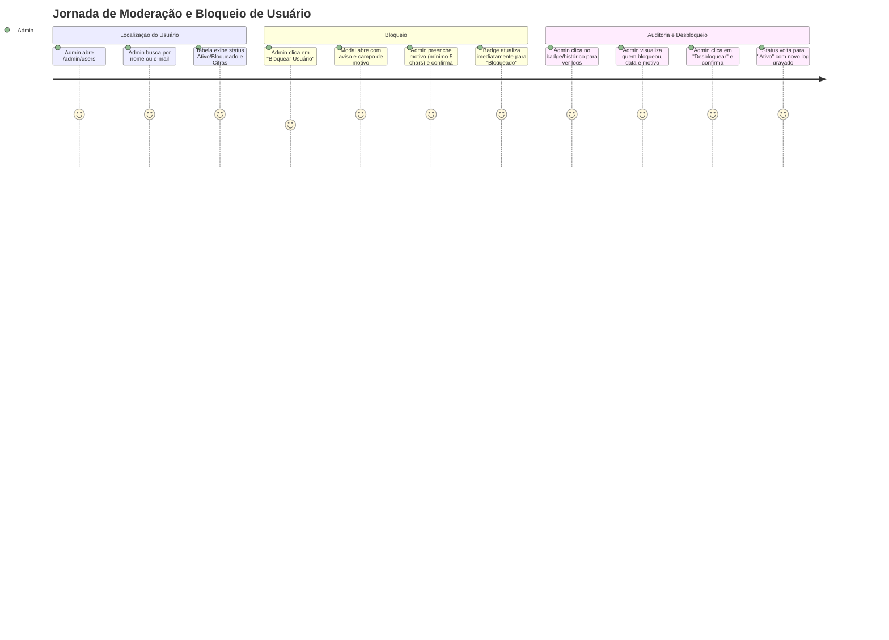

# Spec: Bloqueio e Auditoria de Usuários na Administração (`admin-user-blocking`)

---

## 1. Visão Geral e Intenção de Produto (Feature Discovery)

### 1.1 Contexto e Problema de Negócio
No ecossistema do CifrAS, a moderação e a governança de contas são pilares essenciais para assegurar a integridade da plataforma, combater fraudes, spam, violações de direitos autorais e condutas inadequadas.
Atualmente, o painel administrativo (`codebase-admin`) disponibiliza a listagem de usuários e contagem de cifras, porém **não dispõe de mecanismos para suspender ou bloquear contas infratoras**, tampouco de um registro rastreável de quem executou a ação e por qual razão.

Sem esse mecanismo:
1. **Risco de Segurança e Compliance:** Usuários maliciosos ou contas comprometidas continuam com acesso irrestrito ao sistema e aos recursos colaborativos.
2. **Ausência de Trilha de Auditoria:** Bloqueios arbitrários ou sem justificativa documentada impedem a prestação de contas interna e revisões disciplinares futuras.
3. **Falta de Bloqueio Efetivo em Camada de Aplicação:** Mesmo se um administrador sinalizar uma conta no banco, se a camada de API/Auth não interceptar tokens ativos, o usuário continuará operando normalmente até a expiração natural da sessão.

### 1.2 Objetivo, Hipótese de Valor & Persona
- **Objetivo Primário:** Permitir que administradores bloqueiem e desbloqueiem usuários diretamente pela interface administrativa, exigindo justificativa obrigatória e gravando cada transição em log imutável de auditoria.
- **Impacto de Segurança:** Garantir a invalidação imediata do acesso do usuário bloqueado em todas as rotas autenticadas e tentativas de renovação de sessão (HTTP 403 Forbidden).
- **Persona Principal:** Administrador do Sistema / Moderador de Operações do CifrAS.
- **Hipótese de Valor:** Ao prover um fluxo centralizado de bloqueio com auditoria, o tempo de resposta a incidentes de abuso cai para menos de 30 segundos, com 100% de rastreabilidade de conformidade.

### 1.3 Escopo (In Scope / Out of Scope)
- **Em Escopo (In Scope):**
  - Status de usuário formalizado (`ACTIVE`, `BLOCKED`).
  - Campo de motivo obrigatório para bloqueio (mínimo 5 caracteres).
  - Trilha de auditoria persistida (data/hora UTC, ID e e-mail do administrador executor, motivo, status anterior e status posterior).
  - Ação de desbloqueio com justificativa e novo registro em auditoria.
  - Modal de visualização de histórico de bloqueios/auditoria por usuário.
  - Rejeição na camada de backend com HTTP 403 Forbidden para tokens/requisições de usuários bloqueados.
  - Interface no painel administrativo (`/admin/users`) seguindo o Design System Pinterest-inspired do CifrAS (16px/32px radius, roxo `#aa3bff`, superfícies sem sombras).
  - Suporte completo a internacionalização (`pt-BR`, `en`, `es`).
- **Fora de Escopo (Out of Scope):**
  - Exclusão física definitiva (`hard delete`) da conta auth no Supabase (o usuário permanece arquivado/bloqueado para fins legais/históricos).
  - Sistema de apelação self-service por parte do usuário final (tratado por suporte via e-mail externamente nesta fase).

---

## 2. Papéis, Permissões e Matriz de Acesso (RBAC)

### 2.1 Matriz de Acessibilidade
| Papel | Visualizar Listagem | Bloquear Usuário | Desbloquear Usuário | Visualizar Auditoria | Acessar App Usuário |
|---|:---:|:---:|:---:|:---:|:---:|
| **ADMIN (Painel Adm)** | ✅ Sim | ✅ Sim | ✅ Sim | ✅ Sim | ✅ Sim |
| **USER (Comum Ativo)** | ❌ Proibido (403) | ❌ Proibido (403) | ❌ Proibido (403) | ❌ Proibido (403) | ✅ Sim |
| **USER (Bloqueado)** | ❌ Proibido (403) | ❌ Proibido (403) | ❌ Proibido (403) | ❌ Proibido (403) | ❌ **Negado (403)** |
| **ANÔNIMO** | ❌ Proibido (401) | ❌ Proibido (401) | ❌ Proibido (401) | ❌ Proibido (401) | ⚠️ Apenas público |

### 2.2 Regras de Imutabilidade e Auto-Proteção
1. **Proibição de Auto-Bloqueio:** Um administrador autenticado **não pode** bloquear a sua própria conta no painel. O botão de bloqueio deve vir desabilitado na interface para a própria conta do admin logado, e o backend deve rejeitar a operação com erro `400 Bad Request` (`CANNOT_BLOCK_SELF`).
2. **Proteção de Administradores Master:** Usuários com papel de administrador só podem ser bloqueados caso o executor possua permissão explícita de Super Administrador (ou conforme política de segurança corporativa).

---

## 3. Regras de Negócio e Ciclo de Vida do Usuário

### 3.1 Máquina de Estados do Usuário


### 3.2 Validação do Motivo de Bloqueio
- O campo `reason` é **obrigatório**.
- O texto do motivo deve possuir no **mínimo 5 caracteres** e no **máximo 1000 caracteres** após `trim()` (espaços em branco no início e final são ignorados).
- Tentativas de bloqueio com motivo vazio, preenchido apenas com espaços ou com menos de 5 caracteres são rejeitadas imediatamente no frontend (validação de formulário) e validadas rigorosamente no backend (`400 Bad Request` com código `INVALID_REASON_LENGTH`).

### 3.3 Trilha de Auditoria (Audit Log)
Toda mudança de status gera um registro de auditoria imutável contendo:
- `id`: Identificador único (UUIDv7).
- `user_id`: UUID do usuário alvo do bloqueio/desbloqueio.
- `admin_id`: UUID do administrador que executou a ação.
- `admin_email`: E-mail do administrador executor para rastreabilidade rápida.
- `action`: Tipo de ação (`BLOCK` ou `UNBLOCK`).
- `reason`: Justificativa digitada pelo administrador.
- `previous_status`: Status antes da alteração (`ACTIVE` ou `BLOCKED`).
- `new_status`: Novo status após a alteração (`BLOCKED` ou `ACTIVE`).
- `created_at`: Timestamp UTC da operação.

### 3.4 Comportamento do Usuário Bloqueado (Enforcement & Interceptação)
1. **Tentativa de Acesso com Token Existente:**
   - Ao receber qualquer requisição autenticada, os filtros de segurança do backend (`JwtValidationFilter` / `SecurityUtils`) validam se o `userId` associado está com status `BLOCKED`.
   - Se o usuário estiver bloqueado, a requisição é terminada imediatamente com status **HTTP 403 Forbidden**.
   - Corpo da resposta padronizado:
     ```json
     {
       "error": "ACCOUNT_BLOCKED",
       "message": "Sua conta foi suspensa temporariamente por violar os termos de uso. Entre em contato com o suporte para mais informações.",
       "status": 403
     }
     ```
2. **Tentativa de Autenticação / Refresh de Sessão:**
   - O endpoint de autenticação/refresh checa o status de bloqueio e recusa a emissão de novos tokens, retornando HTTP 403 Forbidden.
3. **Desconexão Proativa no Frontend:**
   - Ao receber `ACCOUNT_BLOCKED` (403), a aplicação cliente do usuário deve limpar as credenciais locais, desconectar a sessão e exibir uma tela amigável informando a suspensão da conta.

---

## 4. Especificação de UX / UI e Jornadas do Usuário (Pinterest-Inspired)

### 4.1 Design System & Tokens Visuais
A interface do painel administrativo segue com rigor o Design System CifrAS documentado em `DESIGN.md`:
- **Geometria:**
  - Botões, Inputs, Cards e Badges: Cantos arredondados de `16px` (`rounded-2xl` / `rounded-md`).
  - Modais de Confirmação e Drawers: Cantos de `32px` (`rounded-3xl`) com backdrop suave escurecido (`bg-black/50 backdrop-blur-xs`).
  - Avatares: Círculo perfeito (`rounded-full`).
- **Paleta de Cores & Superfícies:**
  - **Fundo / Canvas:** Soft Canvas (`#ffffff` / `#fbfbf9`).
  - **Superfície de Cards e Tabelas:** Surface Card (`#f6f6f3`), sem elevações com sombras pesadas (flat chic).
  - **Bordas e Linhas:** Hairline (`#dadad3`).
  - **CTA Primário:** Purple Primary (`#aa3bff` / hover: `#9329e6`), texto branco em negrito.
  - **Ação Crítica / Destrutiva (Bloqueio):** Saturated Red (`#cc001f` / `#e60023`), hover suave.
  - **Badge de Status:**
    - *Ativo:* Fundo verde suave (`bg-[#c7f0da] text-[#103c25] font-bold text-xs px-3 py-1 rounded-full`).
    - *Bloqueado:* Fundo vermelho translúcido (`bg-red-100 text-[#cc001f] font-bold text-xs px-3 py-1 rounded-full border border-red-200`).
- **Tipografia:**
  - Display e Headings: `font-bold` / `font-black` em Ink (`#000000`), subtítulos em Mute (`#62625b`).

### 4.2 Arquitetura de Informação & Jornadas de Uso



#### Jornada 1: Listagem de Usuários (`/admin/users`)
- **Tabela Administrativa:**
  - Coluna **Usuário**: Avatar com inicial, Nome Completo e E-mail.
  - Coluna **Função**: Badge identificando *Administrador* ou *Usuário*.
  - Coluna **Status**: Badge interativo (`Ativo` / `Bloqueado`).
  - Coluna **Cifras**: Total de cifras criadas pelo usuário.
  - Coluna **Cadastro**: Data de criação formatada regionalmente.
  - Coluna **Ações**:
    - Botão "Bloquear" (ícone `Ban` / `ShieldAlert`) se status for `ACTIVE`.
    - Botão "Desbloquear" (ícone `CheckCircle2` / `ShieldCheck`) se status for `BLOCKED`.
    - Botão "Histórico / Auditoria" (ícone `History` / `FileText`) para visualizar logs anteriores.
  - Usuário logado tem suas próprias ações de bloqueio desabilitadas com tooltip explicativo (*"Você não pode bloquear a si mesmo"*).

#### Jornada 2: Modal de Bloqueio de Usuário
1. **Gatilho:** Clique no botão "Bloquear" da linha do usuário.
2. **Estrutura do Modal:**
   - **Cabeçalho:** Ícone de alerta vermelho + Título: *"Bloquear Usuário"*.
   - **Identificação:** Exibe Nome e E-mail do usuário alvo em destaque.
   - **Texto de Alerta:** *"O usuário perderá o acesso imediato ao aplicativo CifrAS e não poderá sincronizar cifras nem acessar playlists."*
   - **Input de Justificativa (`Textarea`):**
     - Label: *"Motivo do Bloqueio (Obrigatório)"*.
     - Placeholder: *"Ex: Publicação recorrente de conteúdo ofensivo ou spam..."*.
     - Contador de caracteres: `0 / 1000` (mínimo 5 caracteres para habilitar envio).
     - Validação inline com mensagem de erro se tentar submeter vazio.
   - **Rodapé de Ações:**
     - Botão Secundário: *"Cancelar"* (`bg-transparent text-[#62625b] hover:bg-gray-100 rounded-md`).
     - Botão Primário Destrutivo: *"Confirmar Bloqueio"* (`bg-[#cc001f] text-white hover:bg-[#a80019] rounded-md font-bold`).
3. **Feedback:** Toast de sucesso com mensagem *"Usuário bloqueado com sucesso"* e atualização otimista da tabela.

#### Jornada 3: Modal de Desbloqueio de Usuário
1. **Gatilho:** Clique no botão "Desbloquear" em usuário com status `BLOCKED`.
2. **Estrutura do Modal:**
   - **Cabeçalho:** Ícone de escudo verde + Título: *"Desbloquear Acesso"*.
   - **Texto Explicativo:** *"Deseja restabelecer o acesso de [Nome do Usuário] à plataforma?"*
   - **Input Opcional/Recomendado de Justificativa:**
     - Label: *"Motivo do Desbloqueio (Opcional)"*.
     - Placeholder: *"Ex: Revisão disciplinar concluída / Solicitação atendida pelo suporte."*
   - **Ações:** Botão "Cancelar" e Botão "Confirmar Desbloqueio" (`bg-[#aa3bff] hover:bg-[#9329e6] text-white`).
3. **Feedback:** Toast com *"Acesso do usuário restabelecido"* e atualização imediata do badge para `Ativo`.

#### Jornada 4: Modal / Drawer de Trilha de Auditoria
1. **Gatilho:** Clique no botão "Histórico de Auditoria" ou no Badge de Status.
2. **Visualização:**
   - Timeline vertical em estilo minimalista.
   - Cada evento lista:
     - Tag da ação: `BLOQUEIO` (vermelho) ou `DESBLOQUEIO` (verde).
     - Data e hora formatada (`DD/MM/AAAA às HH:mm:ss UTC`).
     - Administrador responsável (Nome / E-mail do Admin executor).
     - Caixa de destaque com o motivo registrado.
   - Estado vazio amigável caso a conta nunca tenha sofrido ações de moderação.

### 4.3 Internacionalização (i18n)

Todas as mensagens e labels devem ser cadastradas nos arquivos de tradução correspondentes (`pt.json`, `en.json`, `es.json`):

#### Estrutura de Chaves i18n
```json
{
  "adminUsers": {
    "status": {
      "active": "Ativo",
      "blocked": "Bloqueado"
    },
    "actions": {
      "block": "Bloquear",
      "unblock": "Desbloquear",
      "viewHistory": "Histórico de Auditoria",
      "cannotBlockSelf": "Não é permitido bloquear a si próprio"
    },
    "blockModal": {
      "title": "Bloquear Usuário",
      "description": "Ao bloquear este usuário, o acesso ao CifrAS será revogado imediatamente.",
      "targetUser": "Usuário a ser bloqueado",
      "reasonLabel": "Motivo do bloqueio (obrigatório)",
      "reasonPlaceholder": "Informe o motivo detalhado do bloqueio...",
      "minCharsError": "O motivo deve conter no mínimo 5 caracteres.",
      "confirmButton": "Confirmar Bloqueio",
      "cancelButton": "Cancelar",
      "successToast": "Usuário bloqueado com sucesso."
    },
    "unblockModal": {
      "title": "Desbloquear Usuário",
      "description": "Tem certeza de que deseja restabelecer o acesso deste usuário?",
      "reasonLabel": "Motivo do desbloqueio (opcional)",
      "reasonPlaceholder": "Justificativa da liberação...",
      "confirmButton": "Confirmar Desbloqueio",
      "cancelButton": "Cancelar",
      "successToast": "Usuário desbloqueado com sucesso."
    },
    "auditModal": {
      "title": "Trilha de Auditoria do Usuário",
      "noLogs": "Nenhum registro de auditoria encontrado para este usuário.",
      "actionBlock": "Bloqueado",
      "actionUnblock": "Desbloqueado",
      "executedBy": "Executado por",
      "reason": "Motivo registrado"
    }
  }
}
```

---

## 5. Arquitetura de Dados, Endpoints e Contratos Técnicos

### 5.1 Modelo de Dados (PostgreSQL)

#### 1. Tabela `user_audit_logs` (ou `user_block_audit`)
```sql
CREATE TABLE IF NOT EXISTS user_audit_logs (
    id VARCHAR(36) PRIMARY KEY,
    user_id VARCHAR(36) NOT NULL,
    admin_id VARCHAR(36) NOT NULL,
    admin_email VARCHAR(255) NOT NULL,
    action VARCHAR(20) NOT NULL, -- 'BLOCK' | 'UNBLOCK'
    reason TEXT NOT NULL,
    previous_status VARCHAR(20) NOT NULL,
    new_status VARCHAR(20) NOT NULL,
    created_at TIMESTAMP WITH TIME ZONE NOT NULL DEFAULT NOW()
);

CREATE INDEX idx_user_audit_logs_user_id ON user_audit_logs(user_id, created_at DESC);
CREATE INDEX idx_user_audit_logs_admin_id ON user_audit_logs(admin_id);
```

#### 2. Estado de Bloqueio em `auth.users` / Metadados ou Tabela Auxiliar `user_profiles`
O status do usuário é mantido de forma atômica no metadata da conta (`app_metadata.is_blocked` = `true/false` e `app_metadata.status` = `'BLOCKED'/'ACTIVE'`) e/ou refletido em tabela de perfil persistida, garantindo que consultas tanto no `codebase-admin` quanto no backend principal `codebase` leiam o status com latência mínima.

### 5.2 Contratos de API REST (`codebase-admin`)

#### 1. Bloquear Usuário
- **Rota:** `POST /admin/users/{id}/block`
- **Headers:** `Authorization: Bearer <ADMIN_JWT>`
- **Request Body:**
  ```json
  {
    "reason": "Violação recorrente de conduta e publicação de cifras fraudulentas."
  }
  ```
- **Responses:**
  - `200 OK`:
    ```json
    {
      "id": "123e4567-e89b-12d3-a456-426614174000",
      "email": "infrator@cifras.com",
      "fullName": "João Infrator",
      "role": "user",
      "status": "BLOCKED",
      "isBlocked": true,
      "lastBlockReason": "Violação recorrente de conduta...",
      "updatedAt": "2026-08-25T14:45:00Z"
    }
    ```
  - `400 Bad Request`: `{ "error": "INVALID_REASON", "message": "O motivo do bloqueio é obrigatório e deve ter no mínimo 5 caracteres." }`
  - `400 Bad Request`: `{ "error": "CANNOT_BLOCK_SELF", "message": "Um administrador não pode bloquear a sua própria conta." }`
  - `403 Forbidden`: Se o chamador não possuir privilégio de administrador.
  - `404 Not Found`: Se o usuário alvo não existir.

#### 2. Desbloquear Usuário
- **Rota:** `POST /admin/users/{id}/unblock`
- **Headers:** `Authorization: Bearer <ADMIN_JWT>`
- **Request Body:**
  ```json
  {
    "reason": "Recurso acatado pela equipe de segurança."
  }
  ```
- **Responses:**
  - `200 OK`: Retorna objeto atualizado com `status: "ACTIVE"` e `isBlocked: false`.
  - `403 Forbidden` / `404 Not Found`.

#### 3. Obter Histórico de Auditoria do Usuário
- **Rota:** `GET /admin/users/{id}/audit-logs`
- **Headers:** `Authorization: Bearer <ADMIN_JWT>`
- **Response:**
  - `200 OK`:
    ```json
    [
      {
        "id": "01918a32-1234-789a-bcde-f0123456789a",
        "userId": "123e4567-e89b-12d3-a456-426614174000",
        "adminId": "987e6543-e21b-32d1-b654-123456789abc",
        "adminEmail": "admin@cifras.com",
        "action": "BLOCK",
        "reason": "Violação recorrente de conduta...",
        "previousStatus": "ACTIVE",
        "newStatus": "BLOCKED",
        "createdAt": "2026-08-25T14:45:00Z"
      }
    ]
    ```

### 5.3 Enforce de Segurança no Backend Principal (`codebase`)
1. O interceptor de segurança JAX-RS (`JwtValidationFilter` e `SecurityUtils`) deve consultar o status do usuário ao validar o token JWT.
2. Caso o usuário conste como `BLOCKED`, a requisição é rejeitada imediatamente com HTTP `403 Forbidden` (`ACCOUNT_BLOCKED`), evitando o consumo de processamento dos casos de uso de playlists, músicas, grupos e cifras.

---

## 6. Avaliação Técnica de Performance e Segurança

### 6.1 Performance de Banco de Dados
- **Lookup Indexado:** A tabela `user_audit_logs` utiliza índice composto `(user_id, created_at DESC)` garantindo que a recuperação da trilha de um usuário seja realizada em tempo sub-milissegundo ($< 5\text{ms}$).
- **Prevenção de N+1 na Listagem:** Ao listar usuários no painel (`GET /admin/users`), o status e o motivo do último bloqueio devem ser recuperados em query agregada única ou via campos persistidos no perfil, sem realizar buscas secundárias em loop.

### 6.2 Frontend & Core Web Vitals
- **Cumulative Layout Shift (CLS < 0.1):** A tabela de usuários e o modal de histórico utilizam Skeleton Loaders para preenchimento de layout durante requisições assíncronas.
- **Interaction to Next Paint (INP < 50ms):** Abertura de modais e alteração de texto no input com manipulação em estado local isolado.
- **Debounce de Validação:** Contador de caracteres e habilitação do botão sem causar re-renders do componente pai da tabela.

---

## 7. Critérios de Aceite Binários (Acceptance Criteria - ACs)

- [ ] **AC-01 (RBAC de Acesso Administrativo):** Apenas usuários autenticados com papel de administrador conseguem acessar `/admin/users` e acionar os endpoints de bloqueio/desbloqueio/auditoria. Requisições sem privilégio retornam HTTP 403.
- [ ] **AC-02 (Proibição de Auto-Bloqueio):** Um administrador logado não consegue acionar o bloqueio contra sua própria conta (botão desabilitado na UI e validação no backend retornando HTTP 400 `CANNOT_BLOCK_SELF`).
- [ ] **AC-03 (Validação de Motivo Obrigatório):** O formulário de bloqueio exige preenchimento obrigatório do campo motivo com no mínimo 5 caracteres úteis. O botão "Confirmar Bloqueio" permanece desabilitado até atingir o limite mínimo, e o backend rejeita payloads inválidos com HTTP 400.
- [ ] **AC-04 (Registro e Persistência de Auditoria):** Ao bloquear ou desbloquear um usuário, um registro é gravado atomicamente em `user_audit_logs` contendo data/hora UTC, ID do admin, e-mail do admin, motivo, ação executada e status anterior/novo.
- [ ] **AC-05 (Listagem de Status na UI):** A tabela de usuários exibe distintamente o badge de status `Ativo` (verde) ou `Bloqueado` (vermelho), além das ações contextuais correspondentes ("Bloquear" para ativos, "Desbloquear" para bloqueados).
- [ ] **AC-06 (Consulta da Trilha de Auditoria):** O administrador consegue abrir o histórico de auditoria de qualquer usuário e visualizar cronologicamente todas as ações de moderação aplicadas.
- [ ] **AC-07 (Interceptação Imediata na API de Usuários):** Quando um usuário com status `BLOCKED` envia requisições autenticadas para o backend principal (`codebase`), a requisição é barrada com HTTP 403 Forbidden (`ACCOUNT_BLOCKED`).
- [ ] **AC-08 (Desbloqueio com Registro):** Ao desbloquear um usuário, o status transita para `ACTIVE`, o acesso às rotas do app volta a ser permitido e uma entrada de ação `UNBLOCK` é registrada na auditoria.
- [ ] **AC-09 (Design System Pinterest-Inspired):** A interface respeita os raios de curvatura (16px para botões/inputs e 32px para modais), paleta de cores (`#aa3bff`, `#cc001f`, `#f6f6f3`), tipografia definida e superfícies flat sem sombras decorativas.
- [ ] **AC-10 (Suporte a i18n):** 100% dos textos dos modais, badges, toasts e tooltips de bloqueio/auditoria estão traduzidos nos idiomas `pt-BR`, `en` e `es`.

---

## 8. Classificação de Impacto e Governança de Testes (Gate I3)

- **Classificação de Impacto:** **Nível I3 (Crítico - Autenticação, Autorização, Segurança e Auditoria)**
  - *Justificativa:* Envolve controle de acesso, restrição de credenciais, autorização em tempo de execução, bloqueio em camadas de segurança e armazenamento de dados de conformidade legal/auditoria.
  - *Gates Obrigatórios de Qualidade:*
    - **Backend (`codebase-admin` e `codebase`):**
      - Testes unitários para UseCases (`BlockUserUseCase`, `UnblockUserUseCase`, `GetUserAuditLogsUseCase`).
      - Testes de integração JAX-RS com Testcontainers cobrindo:
        - Tentativa de bloqueio por não-admin (esperado 403).
        - Tentativa de auto-bloqueio (esperado 400).
        - Bloqueio com motivo menor que 5 caracteres (esperado 400).
        - Bloqueio bem-sucedido e persistência em log de auditoria (esperado 200).
        - Desbloqueio e reversão de status (esperado 200).
        - Interceptação de segurança contra token de usuário bloqueado (esperado 403).
      - Cobertura de código: $\ge 90\%$ nas classes modificadas e criadas.
    - **Frontend (`codebase-admin/src/main/webui`):**
      - Testes unitários e de renderização de componentes (`UsersPage`, `BlockUserModal`, `AuditHistoryModal`) com Vitest e Testing Library.
      - Validação de estados de loading, mensagens de erro e desabilitação de botões.
    - **E2E:** Teste automatizado Playwright simulando o fluxo de ponta a ponta: login de admin -> busca de usuário -> bloqueio com motivo -> verificação do badge e da trilha de auditoria -> desbloqueio.
