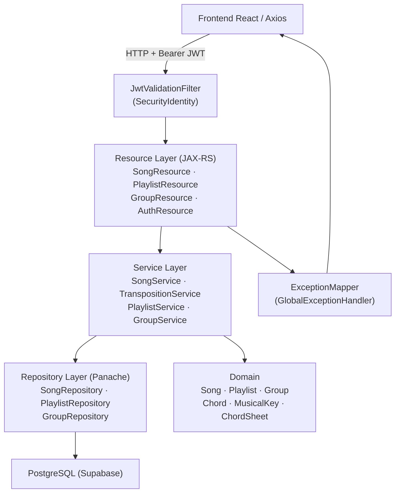
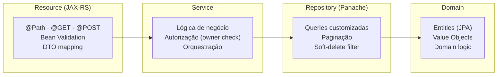
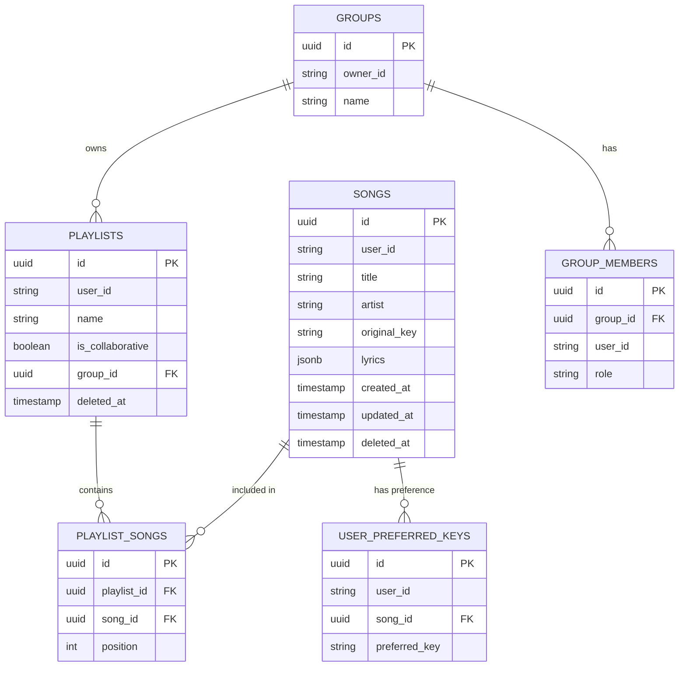
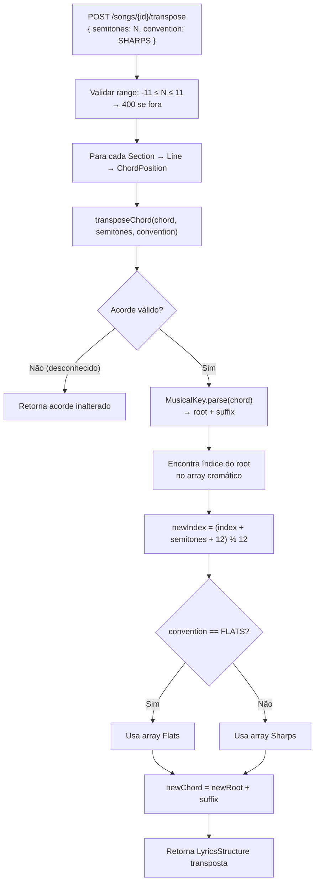
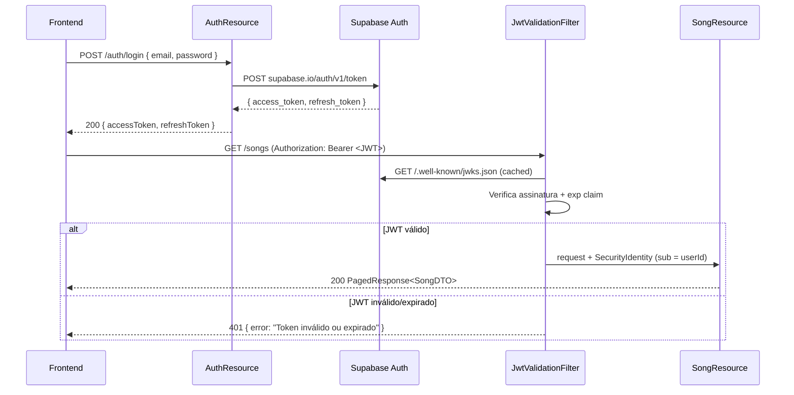

# CifrAS — Backend Design

**Spec**: `.specs/features/backend/spec.md`
**Status**: Draft

---

## Architecture Overview

API RESTful em Quarkus 3.x com arquitetura em camadas (Resource → Service → Repository → Domain). A autenticação é delegada ao Supabase Auth via validação de JWT com MicroProfile JWT. O banco de dados é PostgreSQL via Supabase, acessado com Panache (Active Record pattern).



---

## Code Reuse Analysis

### Existing Components to Leverage

| Component | Location | How to Use |
|---|---|---|
| Panache Active Record | `extends PanacheEntity` | Todas as entidades herdam; `persist()`, `findById()`, `listAll()` built-in |
| MicroProfile JWT | `@Inject JsonWebToken jwt` | Extrair `sub` (userId) em qualquer Resource |
| Hibernate Validator | Anotações Bean Validation | `@NotBlank`, `@Size`, `@Min`/`@Max` nos DTOs de request |
| Quarkus Security | `@RolesAllowed`, `@Authenticated` | Proteger endpoints sem boilerplate |

### Integration Points

| System | Integration Method |
|---|---|
| Supabase Auth | JWKS endpoint configurado em `mp.jwt.verify.publickey.location`; JWT validado automaticamente pelo MicroProfile JWT |
| PostgreSQL (Supabase) | `quarkus.datasource.jdbc.url` + connection pool via Agroal |
| Soft Delete | Campo `deletedAt` em todas as entidades; queries filtram `WHERE deleted_at IS NULL` |

---

## Architecture: Camadas



---

## Components

### `AuthResource`
- **Purpose**: Proxy de registro/login para o Supabase Auth; não armazena senha localmente
- **Location**: `br.com.cifras.auth.resource.AuthResource`
- **Interfaces**:
  - `POST /auth/register` → `201 { user_id, email }` ou `409 Conflict`
  - `POST /auth/login` → `200 { accessToken, refreshToken }` ou `401`
- **Dependencies**: `AuthService`, Supabase Auth REST API (HTTP client)
- **Notes**: Quarkus chama Supabase Auth API e repassa os tokens; nenhuma senha é persistida no PostgreSQL local

### `JwtValidationFilter`
- **Purpose**: Valida JWT Supabase em todas as rotas protegidas e popula `SecurityIdentity`
- **Location**: `br.com.cifras.shared.security.JwtValidationFilter`
- **Interfaces**: `@ServerRequestFilter` (RESTEasy Reactive)
- **Dependencies**: MicroProfile JWT (`mp.jwt.verify.publickey.location` = Supabase JWKS URL)
- **Notes**: Extrai `sub` claim como `userId`; rotas públicas (`/auth/*`) anotadas com `@PermitAll`

### `SongResource`
- **Purpose**: Endpoints CRUD de músicas + transposição on-the-fly
- **Location**: `br.com.cifras.song.resource.SongResource`
- **Interfaces**:
  - `GET /songs` → `PagedResponse<SongSummaryDTO>` (suporta `?q=` e `?transpose=N`)
  - `POST /songs` → `201 SongDTO`
  - `GET /songs/{id}` → `SongDTO` (suporta `?transpose=N`)
  - `PUT /songs/{id}` → `200 SongDTO`
  - `DELETE /songs/{id}` → `204`
  - `POST /songs/{id}/transpose` → `SongDTO` com acordes transpostos
  - `PATCH /songs/{id}/preferred-key` → `200` (P2)
- **Dependencies**: `SongService`, `TranspositionService`, `@Inject JsonWebToken`
- **Reuses**: `PagedResponse<T>` DTO genérico

### `SongService`
- **Purpose**: Lógica de negócio de músicas: isolamento por usuário, soft-delete, paginação
- **Location**: `br.com.cifras.song.service.SongService`
- **Interfaces**:
  ```java
  PagedResponse<Song> listByUser(String userId, int page, int pageSize, String query)
  Song findByIdAndUser(UUID id, String userId)  // lança 403 se não for do usuário
  Song create(CreateSongRequest req, String userId)
  Song update(UUID id, UpdateSongRequest req, String userId)
  void softDelete(UUID id, String userId)
  ```
- **Dependencies**: `SongRepository`, `TranspositionService`

### `TranspositionService`
- **Purpose**: Motor de transposição de acordes — lógica de ciclo cromático, parsing de sufixo, acordes compostos
- **Location**: `br.com.cifras.song.service.TranspositionService`
- **Interfaces**:
  ```java
  LyricsStructure transpose(LyricsStructure lyrics, int semitones, EnharmonicConvention convention)
  String transposeChord(String chord, int semitones, EnharmonicConvention convention)
  ```
- **Dependencies**: `MusicalKey` value object, `Chord` domain class
- **Notes**: Componente mais crítico do backend — cobertura de testes ≥ 80% obrigatória

### `PlaylistResource`
- **Purpose**: Endpoints CRUD de playlists + reordenação + gerenciamento de músicas na playlist
- **Location**: `br.com.cifras.playlist.resource.PlaylistResource`
- **Interfaces**:
  - `GET /playlists` → lista de playlists do usuário
  - `POST /playlists` → `201 PlaylistDTO`
  - `GET /playlists/{id}` → `PlaylistDTO` com músicas ordenadas
  - `PUT /playlists/{id}` → `200 PlaylistDTO`
  - `DELETE /playlists/{id}` → `204`
  - `POST /playlists/{id}/songs` → adiciona música na posição
  - `DELETE /playlists/{id}/songs/{songId}` → remove música
  - `PATCH /playlists/{id}/songs/reorder` → nova ordem via `orderedSongIds[]`
- **Dependencies**: `PlaylistService`, `@Inject JsonWebToken`

### `PlaylistService`
- **Purpose**: Lógica de playlists: reordenação, controle de acesso colaborativo, associação a grupos
- **Location**: `br.com.cifras.playlist.service.PlaylistService`
- **Interfaces**:
  ```java
  Playlist create(CreatePlaylistRequest req, String userId)
  void addSong(UUID playlistId, UUID songId, int position, String userId)
  void reorder(UUID playlistId, List<UUID> orderedSongIds, String userId)
  void removeSong(UUID playlistId, UUID songId, String userId)
  ```
- **Dependencies**: `PlaylistRepository`, `GroupService` (verificação de membro)

### `GroupResource`
- **Purpose**: Endpoints de grupos: criar, listar, convidar e remover membros
- **Location**: `br.com.cifras.group.resource.GroupResource`
- **Interfaces**:
  - `POST /groups` → `201 GroupDTO`
  - `GET /groups` → lista de grupos do usuário
  - `POST /groups/{id}/members` → convida por email; `404` se email não existe
  - `DELETE /groups/{id}/members/{userId}` → remove membro (apenas OWNER)
- **Dependencies**: `GroupService`, `@Inject JsonWebToken`

### `GroupService`
- **Purpose**: Lógica de grupos: OWNER vs MEMBER, controle de acesso em playlists colaborativas
- **Location**: `br.com.cifras.group.service.GroupService`
- **Interfaces**:
  ```java
  boolean isMember(UUID groupId, String userId)
  boolean isOwner(UUID groupId, String userId)
  void addMember(UUID groupId, String email, String requestingUserId)
  void removeMember(UUID groupId, UUID targetUserId, String requestingUserId)
  ```
- **Dependencies**: `GroupRepository`

### `GlobalExceptionMapper`
- **Purpose**: Mapeia exceções de domínio para respostas HTTP padronizadas com `traceId`
- **Location**: `br.com.cifras.shared.exception.GlobalExceptionMapper`
- **Interfaces**: `@Provider implements ExceptionMapper<Throwable>`
- **Notes**: Loga stack trace em erro 500; retorna `{ error, traceId }` nunca stack trace em produção

---

## Data Models

### Entities (JPA + Panache Active Record)

```java
// Song.java
@Entity
@Table(name = "songs")
public class Song extends PanacheEntity {
    public String userId;           // Supabase Auth UUID (String)
    @NotBlank public String title;
    @NotBlank public String artist;
    public String originalKey;
    @Type(JsonType.class)
    @Column(columnDefinition = "jsonb")
    public LyricsStructure lyrics;
    public Instant createdAt;
    public Instant updatedAt;
    public Instant deletedAt;       // soft delete
}

// Playlist.java
@Entity
@Table(name = "playlists")
public class Playlist extends PanacheEntity {
    public String userId;
    @NotBlank public String name;
    public boolean isCollaborative;
    @ManyToOne public Group group;
    @OneToMany(mappedBy = "playlist", cascade = ALL)
    public List<PlaylistSong> songs;
    public Instant deletedAt;
}

// PlaylistSong.java (junction table com position)
@Entity
@Table(name = "playlist_songs")
public class PlaylistSong extends PanacheEntity {
    @ManyToOne public Playlist playlist;
    @ManyToOne public Song song;
    public int position;            // ordem na playlist
}

// Group.java
@Entity
@Table(name = "groups")
public class Group extends PanacheEntity {
    @NotBlank public String name;
    public String ownerId;
}

// GroupMember.java
@Entity
@Table(name = "group_members")
public class GroupMember extends PanacheEntity {
    @ManyToOne public Group group;
    public String userId;
    @Enumerated(EnumType.STRING)
    public GroupRole role;           // OWNER | MEMBER
}
```

### Domain Value Objects

```java
// MusicalKey.java
public record MusicalKey(String root, String suffix) {
    // root: "A", "A#", "Bb" ...
    // suffix: "m", "7", "m7", "add9", "sus2", "dim", "aug", ""
    public static MusicalKey parse(String chord) { ... }
    public String toString() { return root + suffix; }
}

// Ciclo cromático
// Sharps: ["C","C#","D","D#","E","F","F#","G","G#","A","A#","B"]
// Flats:  ["C","Db","D","Eb","E","F","Gb","G","Ab","A","Bb","B"]
```

### DTOs Request/Response

```java
// CreateSongRequest.java
public record CreateSongRequest(
    @NotBlank String title,
    @NotBlank String artist,
    String originalKey,
    LyricsStructure lyrics
) {}

// SongDTO.java (response)
public record SongDTO(
    UUID id, String title, String artist,
    String originalKey, LyricsStructure lyrics,
    String userPreferredKey,
    Instant createdAt, Instant updatedAt
) {}

// PagedResponse.java
public record PagedResponse<T>(
    List<T> data, long total, int page, int pageSize
) {}

// TransposeRequest.java
public record TransposeRequest(
    @Min(-11) @Max(11) int semitones,
    EnharmonicConvention convention  // SHARPS (default) | FLATS
) {}
```

### Estrutura JSON de Cifra (persistida como JSONB)

```json
{
  "sections": [
    {
      "label": "Verso 1",
      "lines": [
        {
          "chords": [
            { "chord": "Am", "position": 0 },
            { "chord": "E",  "position": 12 }
          ],
          "text": "Letra da música..."
        }
      ]
    }
  ]
}
```

---

## ER Diagram



---

## Transposição: Algoritmo Detalhado



**Casos especiais:**
- Acorde composto `G/B`: transpõe raiz `G` e baixo `B` separadamente
- Sufixos preservados: `m`, `7`, `m7`, `add9`, `sus2`, `dim`, `aug`
- Acorde desconhecido: retornado inalterado, sem falhar o request

---

## Fluxo JWT / Autenticação



---

## Error Handling Strategy

| Error Scenario | HTTP Status | Response Body | Log |
|---|---|---|---|
| JWT ausente | 401 | `{ "error": "Unauthorized" }` | Não |
| JWT inválido/expirado | 401 | `{ "error": "Token inválido ou expirado" }` | Não |
| Email já cadastrado | 409 | `{ "error": "Email já cadastrado" }` | Não |
| Recurso de outro usuário | 403 | `{ "error": "Forbidden" }` | Não |
| Campo obrigatório vazio | 400 | `{ "error": "Validation failed", "fields": [...] }` | Não |
| `semitones` fora do range | 400 | `{ "error": "semitones deve estar entre -11 e 11" }` | Não |
| Email não encontrado (convite) | 404 | `{ "error": "Usuário não encontrado" }` | Não |
| Erro de banco de dados | 500 | `{ "error": "Internal error", "traceId": "..." }` | Sim (stack trace) |
| Dois reorders simultâneos | 409 | `{ "error": "Conflict — tente novamente" }` | Não |

**GlobalExceptionMapper** captura todas as exceções; nunca expõe stack trace em produção.

---

## Tech Decisions

| Decision | Choice | Rationale |
|---|---|---|
| ORM | Panache Active Record | Reduz boilerplate vs Repository puro; suficiente para MVP |
| JWT validation | MicroProfile JWT + Supabase JWKS | Integração nativa Quarkus; JWKS cacheado automaticamente |
| Convenção enarmônica default | Sustenidos (`#`) | Mais comum em cifras brasileiras; configurável em v2 |
| Soft delete | Campo `deletedAt` + query filter | Auditoria e possível recuperação; todos os repositories filtram `deleted_at IS NULL` |
| Transposição | Stateless on-the-fly (`?transpose=N`) | Sem estado extra no banco; tom preferido salvo opcionalmente (P2) |
| Cifra como JSONB | PostgreSQL JSONB | Permite queries por acordes (P2 busca), schema-less para evolução futura |
| Paginação default | `page=1, pageSize=20` | Definido como padrão; evita queries sem limite |
| Optimistic locking para reorder | `@Version` em `PlaylistSong` | Previne conflito de reordenação simultânea |
| Estrutura de pacotes | Por domínio (song, playlist, group) | DDD-lite; cada domínio é auto-suficiente; evoluível para microsserviços |
| Auth proxy | Backend chama Supabase Auth API | Frontend nunca chama Supabase diretamente; backend controla a integração |

---

## Package Structure

```
br.com.cifras/
├── auth/
│   ├── resource/AuthResource.java
│   └── service/AuthService.java
├── song/
│   ├── resource/SongResource.java
│   ├── service/SongService.java
│   ├── service/TranspositionService.java
│   ├── repository/SongRepository.java
│   └── domain/
│       ├── Song.java
│       ├── LyricsStructure.java
│       ├── Section.java
│       ├── Line.java
│       ├── ChordPosition.java
│       ├── MusicalKey.java
│       └── EnharmonicConvention.java
├── playlist/
│   ├── resource/PlaylistResource.java
│   ├── service/PlaylistService.java
│   ├── repository/PlaylistRepository.java
│   └── domain/
│       ├── Playlist.java
│       └── PlaylistSong.java
├── group/
│   ├── resource/GroupResource.java
│   ├── service/GroupService.java
│   ├── repository/GroupRepository.java
│   └── domain/
│       ├── Group.java
│       ├── GroupMember.java
│       └── GroupRole.java
└── shared/
    ├── exception/GlobalExceptionMapper.java
    ├── exception/ForbiddenException.java
    ├── exception/NotFoundException.java
    ├── dto/PagedResponse.java
    └── security/SecurityUtils.java
```

---

## Requirement Traceability

| Requirement ID | Componente(s) | Status |
|---|---|---|
| AUTH-01/02 | `AuthResource`, `JwtValidationFilter` | Design ✅ |
| SONG-01/05 | `SongResource`, `SongService`, `SongRepository` | Design ✅ |
| SONG-04 | `LyricsStructure` (JSONB) | Design ✅ |
| TRANSP-01/02 | `TranspositionService`, `MusicalKey`, `SongResource ?transpose=N` | Design ✅ |
| TRANSP-03 | `PATCH /songs/{id}/preferred-key` (P2) | Design ✅ |
| PLAYLIST-01/03 | `PlaylistResource`, `PlaylistService`, `PlaylistRepository` | Design ✅ |
| PLAYLIST-02 | `PATCH /playlists/{id}/songs/reorder`, optimistic locking | Design ✅ |
| GROUP-01/02 | `GroupResource`, `GroupService`, controle OWNER/MEMBER | Design ✅ |
| SEARCH-01 | `GET /songs?q=` (P2) — full-text via PostgreSQL `ILIKE` ou `tsvector` | Design ✅ |
| THEATER-01 | `POST/GET /playlists/{id}/session` (P3) | Design ✅ |
