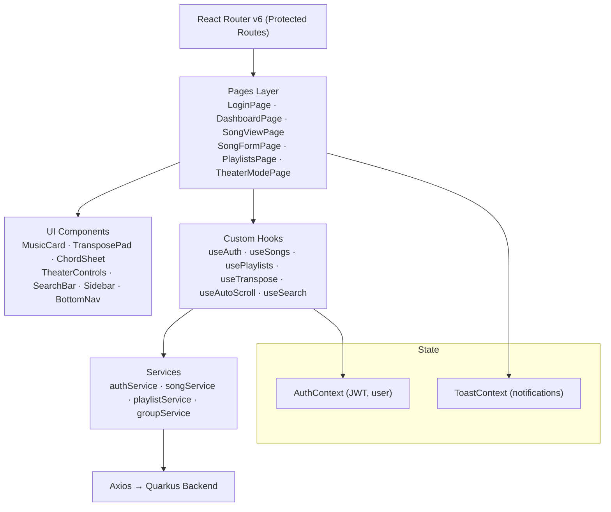
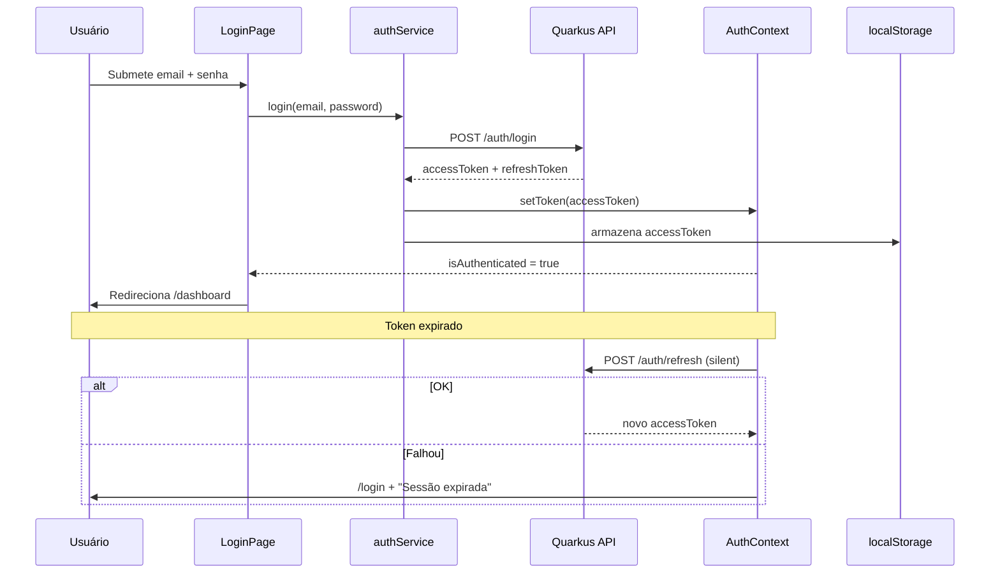
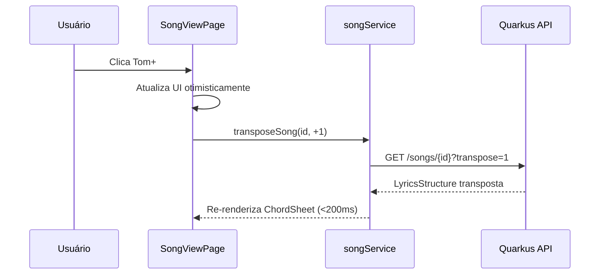

# CifrAS — Frontend Design

**Spec**: `.specs/features/frontend/spec.md`
**Status**: Draft

---

## Architecture Overview

SPA React 18 com roteamento client-side (React Router v6), TailwindCSS, Axios e Context API. Camadas: Pages → Components → Hooks → Services → API.



---

## Code Reuse Analysis

### Existing Components to Leverage

| Component | Location | How to Use |
|---|---|---|
| `TransposePad` | `src/components/music/TransposePad.tsx` | Reutilizado em `SongViewPage` e `TheaterModePage` |
| `MusicCard` | `src/components/cards/MusicCard.tsx` | Dashboard, SongsListPage, SearchPage, SharedWithMePage |
| `ConfirmModal` | `src/components/modals/ConfirmModal.tsx` | Qualquer ação destrutiva (delete música, delete playlist) |
| `SkeletonCard` | `src/components/ui/SkeletonCard.tsx` | Todos os grids com loading state |
| `ToastNotification` | `src/components/ui/ToastNotification.tsx` | Singleton via ToastContext |
| `useAuth` | `src/hooks/useAuth.ts` | Todas as páginas protegidas e no PrivateRoute |

### Integration Points

| System | Integration Method |
|---|---|
| Quarkus Backend | Axios com `Authorization: Bearer <JWT>` |
| Supabase Auth | JWT recebido do backend; armazenado em `localStorage` |
| React Router v6 | `<PrivateRoute>` verifica `AuthContext` antes de renderizar |
| Fullscreen API | `document.requestFullscreen()` no `TheaterModePage` |

---

## Components

### `PrivateRoute`
- **Purpose**: HOC que redireciona para `/login` se não há JWT válido
- **Location**: `src/components/auth/PrivateRoute.tsx`
- **Interfaces**: `<PrivateRoute><PageComponent /></PrivateRoute>`
- **Dependencies**: `AuthContext`, React Router `<Navigate>`
- **Reuses**: `useAuth` hook

### `AuthContext`
- **Purpose**: Provê `user`, `token`, `login()`, `logout()` para toda a árvore
- **Location**: `src/context/AuthContext.tsx`
- **Interfaces**:
  ```typescript
  interface AuthContextValue {
    user: User | null
    token: string | null
    login(email: string, password: string): Promise<void>
    logout(): void
    isAuthenticated: boolean
  }
  ```
- **Dependencies**: `authService`, `localStorage`

### `MusicCard`
- **Purpose**: Card de música no grid (thumbnail, título, artista, tom, chips, favorito, menu ⋮)
- **Location**: `src/components/cards/MusicCard.tsx`
- **Interfaces**:
  ```typescript
  interface MusicCardProps {
    song: Song
    onFavorite(id: string): void
    onEdit(id: string): void
    onDelete(id: string): void
    onShare(id: string): void
    onClick(id: string): void
  }
  ```
- **Dependencies**: Design System (cores TailwindCSS), `ConfirmModal`
- **Reuses**: `SkeletonCard` no loading state

### `TransposePad`
- **Purpose**: Trio `[-] [Tom Atual] [+]` para transposição
- **Location**: `src/components/music/TransposePad.tsx`
- **Interfaces**:
  ```typescript
  interface TransposePadProps {
    currentKey: string
    onTranspose(semitones: number): void
    disabled?: boolean
  }
  ```
- **Dependencies**: TailwindCSS, `#1F2937` bg, `#8B5CF6` texto do tom
- **Notes**: UI atualiza otimisticamente antes da resposta da API

### `ChordSheet`
- **Purpose**: Renderiza `LyricsStructure` em formato monospace alinhado
- **Location**: `src/components/music/ChordSheet.tsx`
- **Interfaces**:
  ```typescript
  interface ChordSheetProps {
    lyrics: LyricsStructure
    fontSize?: number
    virtualizeThreshold?: number  // default: 500 linhas
  }
  ```
- **Dependencies**: `react-window` (virtualização para >500 linhas), Courier New
- **Notes**: Edge case documentado no spec; virtualização automática

### `AutoScrollEngine` (hook)
- **Purpose**: Controla rolagem automática suave no Modo Teatro
- **Location**: `src/hooks/useAutoScroll.ts`
- **Interfaces**:
  ```typescript
  interface UseAutoScrollReturn {
    isScrolling: boolean
    speed: number  // 1-10
    play(): void
    pause(): void
    setSpeed(speed: number): void
    containerRef: React.RefObject<HTMLElement>
  }
  ```
- **Dependencies**: `requestAnimationFrame`, `useRef`

### `TheaterControls`
- **Purpose**: Barra de controles do Modo Teatro (tom, nav, play/pause, velocidade, sair)
- **Location**: `src/components/theater/TheaterControls.tsx`
- **Interfaces**:
  ```typescript
  interface TheaterControlsProps {
    currentKey: string
    onTranspose(semitones: number): void
    onPrevSong(): void
    onNextSong(): void
    isScrolling: boolean
    onToggleScroll(): void
    speed: number
    onSpeedChange(speed: number): void
    onExit(): void
  }
  ```
- **Dependencies**: `TransposePad`, `useAutoScroll`, Fullscreen API
- **Notes**: Touch targets mínimos 48px, fundo `rgba(0,0,0,0.6)`
- **Reuses**: `TransposePad`

### `SearchBar`
- **Purpose**: Busca global no Header com dropdown de resultados em tempo real
- **Location**: `src/components/search/SearchBar.tsx`
- **Interfaces**: `<SearchBar onResultSelect(songId: string) />`
- **Dependencies**: `useSearch` hook (debounce 300ms), `useNavigate`
- **Notes**: Enter navega para `/search?q={termo}`

### `Sidebar` / `BottomNav`
- **Purpose**: Navegação principal desktop (Sidebar) e mobile (BottomNav)
- **Location**: `src/components/layout/Sidebar.tsx`, `src/components/layout/BottomNav.tsx`
- **Interfaces**: `<Sidebar activeRoute={string} />` / `<BottomNav activeRoute={string} />`
- **Dependencies**: React Router `NavLink`, Design System

### `ConfirmModal`
- **Purpose**: Modal genérico de confirmação para ações destrutivas
- **Location**: `src/components/modals/ConfirmModal.tsx`
- **Interfaces**:
  ```typescript
  interface ConfirmModalProps {
    isOpen: boolean
    title: string
    message: string
    confirmLabel?: string
    onConfirm(): void
    onCancel(): void
    variant?: 'danger' | 'warning'
  }
  ```
- **Dependencies**: Design System (Danger `#EF4444`)

### `SkeletonCard`
- **Purpose**: Placeholder animado para Music Cards durante carregamento
- **Location**: `src/components/ui/SkeletonCard.tsx`
- **Interfaces**: `<SkeletonCard count={number} />`
- **Dependencies**: TailwindCSS `animate-pulse`
- **Notes**: Grid 3 cols desktop, 2 tablet, 1 mobile

### `ToastNotification`
- **Purpose**: Notificações globais (sucesso, erro, aviso)
- **Location**: `src/components/ui/ToastNotification.tsx` + `src/context/ToastContext.tsx`
- **Interfaces**:
  ```typescript
  interface ToastContextValue {
    showToast(message: string, type: 'success' | 'error' | 'warning'): void
  }
  ```

---

## Data Models

```typescript
interface User {
  id: string        // Supabase Auth UUID
  email: string
  name: string
}

interface Song {
  id: string
  title: string
  artist: string
  originalKey: string
  lyrics: LyricsStructure
  isFavorite?: boolean
  userPreferredKey?: string | null  // P2
  createdAt: string
  updatedAt: string
}

interface LyricsStructure {
  sections: Section[]
}

interface Section {
  label: string      // "Verso 1", "Refrão"
  lines: Line[]
}

interface Line {
  chords: ChordPosition[]
  text: string
}

interface ChordPosition {
  chord: string      // "Am", "G7", "C/E"
  position: number   // índice de caractere na linha
}

interface Playlist {
  id: string
  name: string
  isCollaborative: boolean
  groupId?: string
  songs: PlaylistSong[]
  songCount: number
  createdAt: string
}

interface PlaylistSong {
  songId: string
  title: string
  artist: string
  currentKey: string
  position: number
}

interface Group {
  id: string
  name: string
  memberCount: number
  members: GroupMember[]
}

interface GroupMember {
  userId: string
  name: string
  email: string
  role: 'OWNER' | 'MEMBER'
}

interface PagedResponse<T> {
  data: T[]
  total: number
  page: number
  pageSize: number
}
```

---

## Sequence Diagrams





---

## Error Handling Strategy

| Error Scenario | Handling | User Impact |
|---|---|---|
| Login inválido (401) | Erro inline abaixo do campo | "Email ou senha incorretos" |
| Token expirado | Silent refresh; se falhar → redirect | Toast "Sessão expirada" + /login |
| Rota protegida sem JWT | `PrivateRoute` redireciona | Redirect transparente |
| API 403 Forbidden | Toast de erro global | "Sem acesso a esse recurso" |
| API 500 | Interceptor Axios → ToastContext | "Erro interno. Tente novamente." |
| Offline no Modo Teatro | Mantém dados já carregados | Sem error screen; continuidade |
| Cifra >500 linhas | `react-window` virtualização automática | Performance preservada |
| Formulário inválido | Validação inline onChange/onBlur | Borda `#EF4444` + mensagem abaixo do campo |
| Edição com alterações não salvas | `ConfirmModal` antes de navegar | "Deseja descartar as alterações?" |

---

## Tech Decisions

| Decision | Choice | Rationale |
|---|---|---|
| Estado global | Context API (v1) → Zustand (se necessário) | Suficiente para MVP; migrar apenas se surgir complexidade |
| HTTP Client | Axios | Interceptors para JWT injection e refresh automático |
| Roteamento | React Router v6 | `<Outlet>` simplifica layouts aninhados |
| Transposição UI | Otimismo + re-fetch | UI atualiza imediatamente; confirma com resposta da API |
| Virtualização | `react-window` | Edge case cifras >500 linhas; previne jank de scroll |
| DnD playlists | **PENDENTE**: `dnd-kit` (recomendado) | `dnd-kit` moderno e mantido; `react-beautiful-dnd` em modo manutenção |
| Velocidade default rolagem | **PENDENTE** | Definir com testes com músicos; sugestão: 3/10 |
| JWT storage | `localStorage` (access token) | Simples para MVP; httpOnly cookie para refresh em v2 |
| Fontes | Inter (Google Fonts) + Courier New (sistema) | Inter para legibilidade; Courier New sem dependência externa |
| Fullscreen | Fullscreen API nativa | Sem biblioteca; prefixos webkit necessários para iOS Safari |

---

## Requirement Traceability

| Requirement ID | Componente(s) | Status |
|---|---|---|
| FE-AUTH-01/02 | `LoginPage`, `RegisterPage`, `AuthContext` | Design ✅ |
| FE-AUTH-03 | `PrivateRoute`, `AuthContext` | Design ✅ |
| FE-SONG-01 | `DashboardPage`, `MusicCard`, `SkeletonCard` | Design ✅ |
| FE-SONG-02 | `SongViewPage`, `ChordSheet` | Design ✅ |
| FE-SONG-03/04 | `SongFormPage` | Design ✅ |
| FE-TRANSP-01/02 | `TransposePad`, `useTranspose`, `ChordSheet` | Design ✅ |
| FE-PLAYLIST-01/02/03 | `PlaylistsPage`, `PlaylistViewPage`, DnD (pendente) | Design ✅ |
| FE-THEATER-01/02/03/04 | `TheaterModePage`, `TheaterControls`, `useAutoScroll` | Design ✅ |
| FE-SEARCH-01 | `SearchBar`, `SearchPage`, `useSearch` | Design ✅ |
| FE-GROUP-01/FE-COLLAB-01 | `GroupsPage`, `GroupCard` (P2) | Design ✅ |
| FE-FAV-01 | `MusicCard` ícone coração (P2) | Design ✅ |
| FE-SETTINGS-01 | `SettingsPage` (P3) | Design ✅ |
