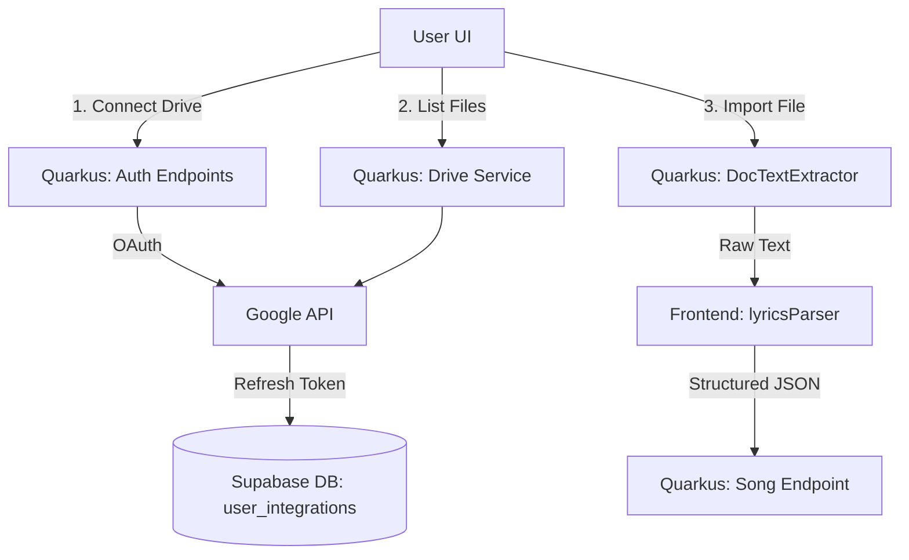

# Google Drive Import Design

**Spec**: `.specs/features/google-drive-import/spec.md`
**Status**: Approved

---

## Architecture Overview

We will use the Quarkus backend to manage the OAuth integration securely and extract text from `.doc`/`.docx` files using Apache POI. The raw text will then be sent to the React frontend, which will utilize the existing `lyricsParser` utility to convert it into the structured CifrAS JSON format.



---

## Code Reuse Analysis

### Existing Components to Leverage

| Component | Location | How to Use |
| --- | --- | --- |
| `lyricsParser` | `src/main/webui/src/utils/` | Instead of rewriting the parsing logic in Java, the backend will only extract raw text and pass it to the frontend's existing parser. |
| `SecurityIdentity` | `br.com.cifras.shared.security` | Used to associate the stored Google refresh token with the currently authenticated Supabase user. |

### Integration Points

| System | Integration Method |
| --- | --- |
| Google Drive API | Server-to-server calls using the stored refresh token to list files and download `.doc`/`.docx` files. |
| Database | New `user_integrations` table (and `UserIntegrationEntity`) mapped to the user ID. |

---

## Components

### `UserIntegrationService` (Backend)
- **Purpose**: Manages storing and retrieving Google OAuth refresh tokens.
- **Location**: `src/main/java/br/com/cifras/user/application/`
- **Interfaces**:
  - `saveGoogleToken(String userId, String refreshToken)`
  - `getGoogleToken(String userId): Optional<String>`

### `GoogleDriveService` (Backend)
- **Purpose**: Interacts with Google APIs to list and download files.
- **Location**: `src/main/java/br/com/cifras/integration/application/`
- **Interfaces**:
  - `getAuthUrl(): String`
  - `exchangeCode(String code, String userId)`
  - `listFiles(String userId): List<DriveFileDTO>`
  - `extractTextFromFile(String userId, String fileId): String`
- **Dependencies**: Google API Client libraries, Apache POI (for text extraction).

### `GoogleDriveResource` (Backend)
- **Purpose**: REST endpoints for the frontend.
- **Location**: `src/main/java/br/com/cifras/integration/resource/`

### `IntegrationsSettingsPage` (Frontend)
- **Purpose**: UI for connecting the Google Drive account.
- **Location**: `src/main/webui/src/pages/`

### `DriveFilePicker` (Frontend)
- **Purpose**: Modal to search/select `.doc` files from the connected drive and trigger the import.
- **Location**: `src/main/webui/src/components/`

---

## Data Models

### `UserIntegration` (Domain)

```java
public class UserIntegration {
    private UUID id;
    private UUID userId;
    private String provider; // e.g., "GOOGLE_DRIVE"
    private String refreshToken;
    private String email; // The Google account email
    // ... constructors, getters, invariants
}
```

---

## Error Handling Strategy

| Error Scenario | Handling | User Impact |
| --- | --- | --- |
| Token Revoked/Expired | Backend catches `401 Unauthorized` from Google, deletes token from DB, returns `401` to frontend. | Prompted to "Reconnect Google Drive". |
| File cannot be parsed | `DocTextExtractor` throws exception if file is corrupted or not a valid Word doc. | Shows error toast: "Failed to read document format." |
