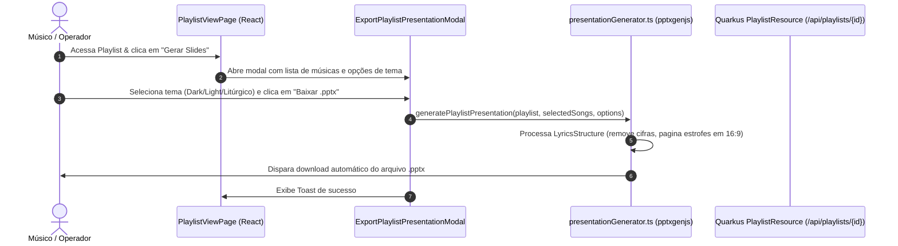

# Technical Design — Playlist Presentation Export (.pptx)

## 1. Visão Geral da Arquitetura

A feature implementa uma solução **Client-First & Offline-Ready** para geração de apresentações de slides no formato PowerPoint (`.pptx`) e cópia de letras limpas a partir de Playlists (privadas e colaborativas).



---

## 2. Mudanças no Backend (Java 21 / Quarkus)

### 2.1 Contrato DTO: `PlaylistSongDTO`
O DTO `PlaylistSongDTO` passa a expor o campo `lyrics` (`LyricsStructure`), permitindo que a visualização da playlist e as ferramentas de exportação tenham acesso à estrutura de seções e linhas de cada música sem requisições adicionais:

```java
@RegisterForReflection
public record PlaylistSongDTO(
    UUID id,
    String title,
    String artist,
    String originalKey,
    LyricsStructure lyrics,
    int position,
    Instant addedAt
) {
    public static PlaylistSongDTO from(PlaylistSong ps) {
        return new PlaylistSongDTO(
            ps.getSong().getId(),
            ps.getSong().getTitle(),
            ps.getSong().getArtist(),
            ps.getSong().getOriginalKey(),
            ps.getSong().getLyrics(),
            ps.getPosition(),
            ps.getSong().getCreatedAt()
        );
    }
}
```

---

## 3. Mudanças no Frontend (React 19 / TypeScript)

### 3.1 Biblioteca: `pptxgenjs`
Utilização da biblioteca `pptxgenjs` para montagem de apresentações no padrão Microsoft PowerPoint:
- Proporção: Widescreen 16:9 (`layout = 'LAYOUT_16x9'`).
- Tipografia: Arial / Helvetica / Inter com alta legibilidade.
- Fundo & Cores:
  - **Dark / Telão (Padrão):** Background `#000000`, Texto `#FFFFFF` (Bold).
  - **Light / Clean:** Background `#FFFFFF`, Texto `#111827`.
  - **Litúrgico / Solene:** Background `#0A1128`, Texto `#F9FAFB`.

### 3.2 Utilitário de Geração: `src/utils/presentationGenerator.ts`
- **Algoritmo de Paginação:**
  - Extrai somente `line.text` de cada linha (ignorando `line.chords`).
  - Divide estrofes longas em blocos de até 5 linhas.
  - Insere slide de abertura da Playlist (opcional).
  - Insere slide de transição de cada música (opcional).
  - Gera os slides de cada estrofe com indicador de seção sutil (`[Refrão]`, `[Verso 1]`).
- **Função de Cópia Limpa:**
  - `exportCleanLyricsText(playlist, songs)`: compila o texto puro para o Clipboard.

### 3.3 Componente Modal: `src/components/modals/ExportPlaylistPresentationModal.tsx`
- Modal acessível, responsivo, compatível com o design system do CifrAS (Pinterest-inspired).
- Suporte a seleção/deseleção de músicas com reordenação visual.
- Seletor visual de temas de projeção.

### 3.4 Integração na Página: `src/pages/PlaylistViewPage.tsx`
- Adição do botão *"Gerar Slides"* no topo da página, ao lado do botão de *Modo Teatro*.
- Acesso liberado para o Dono (playlists privadas) e para Membros (playlists colaborativas/compartilhadas).

---

## 4. Testes & Cobertura

- **Backend:** Testes unitários no `PlaylistSongDTOTest` e integração em `PlaylistResourceTest` cobrindo o retorno de `lyrics`.
- **Frontend:** Testes unitários com Vitest em `presentationGenerator.test.ts` e `ExportPlaylistPresentationModal.test.tsx` garantindo $\ge 90\%$ de cobertura de linhas no diff.
