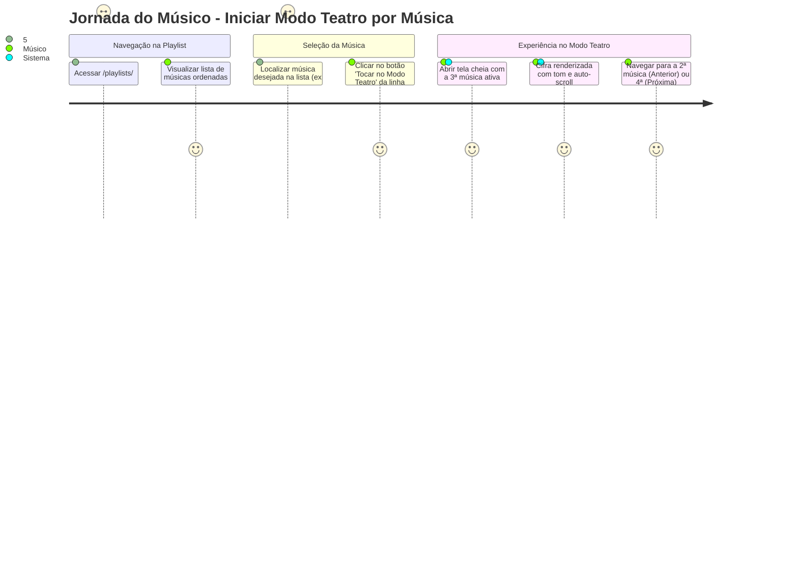

# Especificação: Iniciar Modo Teatro a partir de Música Selecionada na Playlist

## 1. Resumo Funcional

### 1.1 Contexto e Problema
Atualmente, ao acessar a página de detalhes de uma playlist (`/playlists/:id`), os usuários dispõem apenas do botão global "Iniciar Modo Teatro" no cabeçalho superior. Essa ação sempre inicia a reprodução a partir da primeira faixa (índice 0).

Em cenários reais de ensaios, apresentações ao vivo, shows e cultos/missas, músicos e bandas frequentemente precisam:
- Iniciar a apresentação diretamente a partir de uma música intermediária (por exemplo, após um atraso ou divisão de blocos de repertório);
- Ensaiar ou revisar rapidamente uma música específica (ex: a 4ª ou 7ª música da setlist) sem ter que passar manualmente por todas as anteriores;
- Retomar a execução de um ponto específico da playlist mantendo toda a setlist carregada para avançar ou retroceder conforme a dinâmica da apresentação.

### 1.2 Objetivo do Produto
Permitir que o usuário inicie o Modo Teatro diretamente a partir de qualquer música listada na playlist (`/playlists/:id`), carregando imediatamente a cifra da faixa escolhida em tela cheia e mantendo a fila completa da playlist ativa para navegação fluida (músicas anteriores e posteriores).

### 1.3 Escopo da Feature
- **Incluído:**
  - Adição de um botão/ação de reprodução em Modo Teatro em cada item da listagem de músicas em `/playlists/:id`.
  - Mecanismo de navegação passando a identificação da música/índice selecionado para o Modo Teatro (`/theater/:playlistId?songId=:songId` ou similar).
  - Inicialização do `TheaterModePage` posicionando a fila na música selecionada.
  - Navegação bidirecional contínua no Modo Teatro (permitindo retroceder para faixas anteriores e avançar para faixas seguintes dentro da playlist).
  - Adaptação responsiva para Desktop e Mobile com alvo de toque mínimo de 44x44px.
  - Conformidade com o Design System do CifrAS (Pinterest-inspired, sem sombras pesadas, paleta oficial).
  - Acessibilidade completa (ARIA labels descritivos, foco de teclado visível).
  - Internacionalização (i18n) em pt-BR, en e es.
- **Fora de Escopo:**
  - Alteração da ordem persistida das músicas na playlist no banco de dados.
  - Criação de modos de reprodução alternativos (ex: Shuffle / Reprodução Aleatória).
  - Alteração de permissões de edição da playlist (usuários com permissão apenas de leitura também podem tocar qualquer música).

---

## 2. Jornadas do Usuário

### 2.1 Jornada Desktop
1. O músico faz login e navega até a visualização de uma playlist em `/playlists/:id`.
2. A tela exibe a relação ordenada de músicas com título, artista, tom original/atual e controles de ação.
3. Em cada linha de música, um botão de ação de reprodução rápida com o ícone de Play/Modo Teatro está visível.
4. O usuário clica no botão de play da 3ª música.
5. O navegador é direcionado para a rota do Modo Teatro com o identificador da música/índice (ex: `/theater/:playlistId?songId=song-3-id`).
6. O Modo Teatro carrega em tela cheia com a 3ª música ativa, exibindo título, cifra, tom preferido e controles de rolagem.
7. O usuário pode tocar a música e, ao finalizar ou durante o ensaio:
   - Clicar em "Música Anterior" para visualizar a 2ª música;
   - Clicar em "Próxima Música" para visualizar a 4ª música.

### 2.2 Jornada Mobile / Tablet
1. O músico com smartphone ou tablet fixado no pedestal abre `/playlists/:id`.
2. A listagem de músicas é exibida em layout responsivo vertical.
3. Cada linha possui um botão de Play com área de toque ampla ($\ge 44 \times 44\text{ px}$), evitando toques acidentais nos botões de reordenação ou remoção.
4. O músico toca no botão de play da música desejada com um único toque ágil.
5. A tela transiciona diretamente para o Modo Teatro Mobile, com controles de toque grandes, rolagem automática e contraste otimizado para palcos.

### 2.3 Jornada Usuário Não-Proprietário (Playlist Compartilhada / Grupo)
1. Um integrante de um grupo ou usuário convidado acessa uma playlist compartilhada.
2. Os botões de gerenciamento (reordenar, adicionar, remover) não são exibidos por falta de permissão de escrita.
3. Os botões de tocar no Modo Teatro em cada música permanecem totalmente visíveis e funcionais.
4. O usuário clica no botão de qualquer música e inicia sua execução no Modo Teatro normalmente.

---

## 3. Requisitos de UI/UX e Acessibilidade

### 3.1 Alinhamento com o Design System (Pinterest-Inspired)
- **Geometria e Superfície:**
  - Botão de Play na linha da música implementado como um botão de ícone circular (`rounded-full`) ou pílula suave (`rounded-md` com 16px).
  - Superfície limpa sobre o card da música (`bg-transparent` com `hover:bg-emerald-500/10` ou `hover:bg-gray-100 dark:hover:bg-gray-700/50`).
  - Sem sombras decorativas pesadas (`shadow-none`), mantendo a estética flat e minimalista do CifrAS.
- **Paleta de Cores e Ícones:**
  - Ícone: `Play` ou `PlayCircle` (da biblioteca `lucide-react`).
  - Cor do ícone: Verde esmeralda (`#10B981` / `hover:#059669`) em harmonia com o botão principal do cabeçalho "Iniciar Modo Teatro", ou destaque interativo (`text-emerald-600 dark:text-emerald-400`).
- **Dimensões e Touch Targets (Mobile-First):**
  - Desktop: Tamanho visual de ícone $18\text{px} - 20\text{px}$ com padding interativo mínimo de $36\text{px} \times 36\text{px}$.
  - Mobile (viewport $\le 640\text{px}$): Alvo de toque garantido de no mínimo $44\text{px} \times 44\text{px}$ (`min-h-[44px] min-w-[44px]`), cumprindo diretrizes WCAG 2.1 AA.

### 3.2 Acessibilidade (A11y)
- **ARIA e Nomes Acessíveis:**
  - O botão de cada linha deve conter atributo `aria-label` descritivo com o título da música:
    - Exemplo: `aria-label="Tocar [Título da Música] no Modo Teatro"` (via tradução i18n).
  - Atributo de teste padronizado: `data-testid="play-theater-song-${song.id}"`.
- **Foco e Teclado:**
  - O botão deve ser navegável via tecla `Tab`.
  - Deve apresentar anel de foco visível com alto contraste (`focus:outline-none focus:ring-2 focus:ring-[#10B981]`).
  - Acionável por `Enter` e `Space`.

### 3.3 Internacionalização (i18n)
É proibido o uso de strings fixas. As seguintes chaves devem ser suportadas nos dicionários:

| Idioma | Chave de Tradução | Valor |
|---|---|---|
| **pt-BR** | `playlistView.playSongInTheater` | `"Tocar {{title}} no Modo Teatro"` |
| **pt-BR** | `playlistView.playSong` | `"Tocar no Modo Teatro"` |
| **en** | `playlistView.playSongInTheater` | `"Play {{title}} in Theater Mode"` |
| **en** | `playlistView.playSong` | `"Play in Theater Mode"` |
| **es** | `playlistView.playSongInTheater` | `"Reproducir {{title}} en Modo Teatro"` |
| **es** | `playlistView.playSong` | `"Reproducir en Modo Teatro"` |

---

## 4. Regras de Negócio e Comportamento de Fila

### 4.1 Definição das Regras de Negócio

| ID | Regra de Negócio | Detalhe |
|---|---|---|
| **RN-01** | **Indexação Inicial da Fila** | Ao clicar no botão de tocar da música na posição $K$ (onde $0 \le K < N$), o Modo Teatro deve carregar com a música do índice $K$ como a faixa ativa imediata. |
| **RN-02** | **Carga Completa da Setlist** | O Modo Teatro deve carregar todas as $N$ músicas da playlist na fila de reprodução, preservando a ordem exata da playlist. |
| **RN-03** | **Navegação Bidirecional** | A navegação entre faixas no Modo Teatro deve respeitar os limites da playlist: - Se $K > 0$, o botão "Anterior" deve estar ativo e transicionar para o índice $K - 1$. - Se $K = 0$, o botão "Anterior" deve estar desabilitado. - Se $K < N - 1$, o botão "Próximo" deve estar ativo e transicionar para o índice $K + 1$. - Se $K = N - 1$, o botão "Próximo" deve estar desabilitado. |
| **RN-04** | **Preservação do Contrato de Rota** | A rota do Modo Teatro (`/theater/:playlistId`) deve aceitar o identificador da música inicial via query string (ex: `?songId=:songId` ou `?index=:index`) e/ou via `location.state`. Em caso de recarregamento direto (F5), se a query string estiver presente na URL, a música selecionada deve ser reidratada. |
| **RN-05** | **Persistência de Preferências** | As preferências de apresentação da música ativa (tom transposto, velocidade de rolagem e tamanho da fonte) devem ser aplicadas individualmente para a música selecionada conforme as regras do Modo Teatro. |
| **RN-06** | **Compatibilidade com Header** | O botão "Iniciar Modo Teatro" no cabeçalho de `/playlists/:id` continua disponível e inicia a reprodução a partir da primeira música (índice 0) ou da sessão ativa salva. |
| **RN-07** | **Acesso Universal de Leitura** | A ação de reprodução por música deve estar disponível para todos os usuários que têm permissão de visualizar a playlist (donos, membros de grupo e visualizadores de playlists públicas/compartilhadas). |

---

## 5. Critérios de Aceite (Checklist Binário para QA)

- [ ] **AC-01 (Presença visual do botão na lista):** Na tela `/playlists/:id`, cada item da lista de músicas deve exibir um botão com ícone de reprodução/Modo Teatro.
- [ ] **AC-02 (Permissões de exibição):** O botão de reprodução por música deve estar visível e interativo tanto para o proprietário da playlist quanto para usuários não-proprietários com permissão de visualização.
- [ ] **AC-03 (Navegação correta):** Ao clicar no botão de reprodução de uma música específica, o sistema deve navegar para a rota do Modo Teatro correspondente à playlist, passando a referência da música clicada.
- [ ] **AC-04 (Música inicial ativa no Modo Teatro):** Ao carregar o Modo Teatro disparado pelo botão da música, a tela deve exibir imediatamente o título, artista, tom e cifra da música selecionada (e não necessariamente da primeira música da playlist).
- [ ] **AC-05 (Fila completa carregada):** A quantidade total de músicas carregadas no Modo Teatro deve ser igual à quantidade total de músicas da playlist ($N$).
- [ ] **AC-06 (Navegação para música anterior):** Se o usuário iniciou a partir de uma música na posição $K > 0$, o botão "Música Anterior" deve estar habilitado e, ao ser acionado, deve exibir a música da posição $K - 1$.
- [ ] **AC-07 (Navegação para próxima música):** Se o usuário iniciou a partir de uma música na posição $K < N - 1$, o botão "Próxima Música" deve estar habilitado e, ao ser acionado, deve exibir a música da posição $K + 1$.
- [ ] **AC-08 (Desabilitação nos extremos):** Se o usuário estiver na primeira música ($K = 0$), o botão "Anterior" deve estar desabilitado. Se estiver na última música ($K = N - 1$), o botão "Próximo" deve estar desabilitado.
- [ ] **AC-09 (Dimensão mínima de toque Mobile):** Em visualização mobile ($\le 640\text{px}$), o botão de reprodução da música deve ter área de toque de no mínimo $44\text{px} \times 44\text{px}$.
- [ ] **AC-10 (Acessibilidade ARIA e foco):** O botão de reprodução deve possuir `aria-label` descritivo incluindo o título da música, ser focalizável por `Tab` e acionável por `Enter`/`Space`.
- [ ] **AC-11 (Internacionalização):** Todos os textos e rótulos do botão devem ser provenientes de chaves i18n sem nenhuma string hardcoded, com traduções válidas para `pt-BR`, `en` e `es`.
- [ ] **AC-12 (Integridade do botão do header):** O botão "Iniciar Modo Teatro" presente no cabeçalho da playlist deve continuar funcionando e iniciando a partir do índice 0 da playlist.
- [ ] **AC-13 (Cobertura de Testes E2E):** Deve existir pelo menos 1 cenário de teste Playwright cobrindo o fluxo de seleção de uma música intermediária na playlist e a validação da música ativa inicial e navegação de fila no Modo Teatro.

---

## 6. Classificação de Impacto

### Nível de Impacto Consolidado: **I1 — Padrão**

### Justificativa de Engenharia e Produto
- **Sinais Analisados:**
  - Não há alteração de banco de dados, DDL, DML ou migrações SQL.
  - Não há alteração de regras de autenticação, autorização ou segurança.
  - Não há quebra ou modificação em contratos de API REST públicas no backend.
  - Trata-se de uma melhoria de UI/UX e roteamento/estado no frontend (`PlaylistViewPage.tsx` e `TheaterModePage.tsx`).
- **Gates de Entrega Exigidos:**
  - Checagens estáticas: ESLint e TypeScript sem erros/warnings.
  - Testes Unitários de Frontend (Vitest): Cobertura $\ge 90\%$ no diff de código adicionado/alterado.
  - Testes E2E (Playwright): Cenário automatizado validando os critérios de aceite de navegação e fila.
