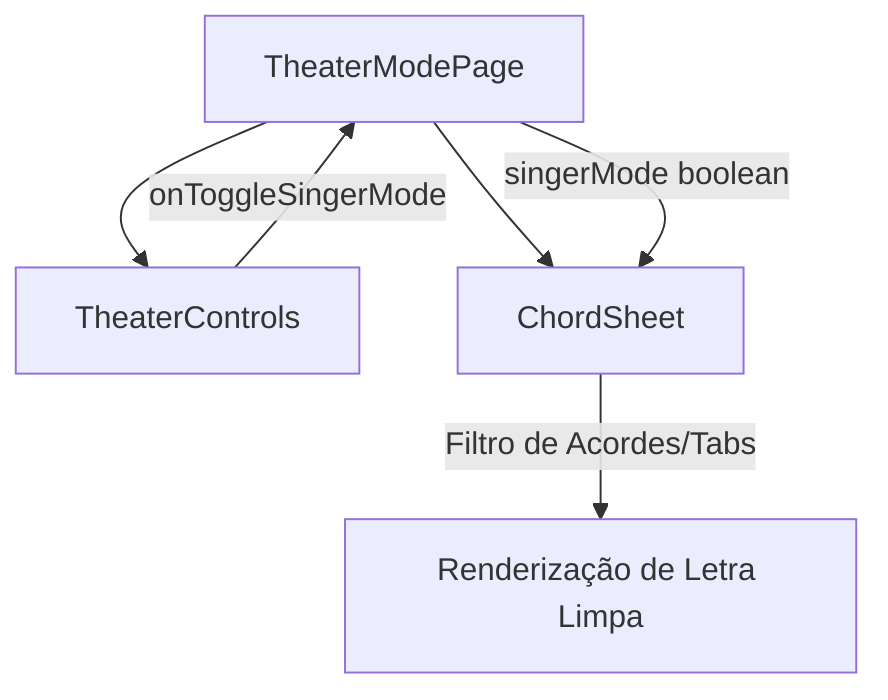

# Design Técnico — Modo Cantor no Modo Teatro 📐

## 1. Visão Geral da Arquitetura

O **Modo Cantor** é implementado como uma funcionalidade reativa client-side de alto desempenho no ecossistema React do CifrAS, permitindo alternar instantaneamente entre a visualização completa (cifras + tablaturas + letra) e a visualização limpa (apenas seções e letras) sem recargas de rede.

---

## 2. Componentes e Estrutura

### 2.1 `ChordSheet.tsx`
- **Nova Propriedade:** `singerMode?: boolean` (default: `false`).
- **Lógica de Filtragem:**
  - Quando `singerMode === true`:
    - `isChordLineHelper(line)` $\to$ omitida.
    - `isTabLine(line)` (iniciada por `e|`, `B|`, `G|`, `D|`, `A|`, `E|`, etc.) $\to$ omitida.
    - `isStrumLine(line)` (diagramas de setas de ritmo) $\to$ omitida.
    - Linhas vazias redundantes decorrentes da remoção das cifras são compactadas para evitar espaços desnecessários.
    - Cabeçalhos de seção (`[Intro]`, `[Verso]`, `[Refrão]`, `[Ponte]`) são preservados como marcadores visuais.
    - Linhas de texto são renderizadas com espaçamento e tipografia harmoniosos.

### 2.2 `TheaterControls.tsx`
- **Novas Propriedades:**
  - `isSingerMode?: boolean;`
  - `onToggleSingerMode?: () => void;`
- **UI & UX:**
  - Adição do botão com ícone `Mic` do `lucide-react`.
  - Quando ativo (`isSingerMode === true`), exibe destaque visual com fundo roxo suave e ícone roxo `#8629cc`.
  - Tooltip/Aria-label dinâmico ("Modo Cantor" / "Modo Cifras").
  - Quando `isSingerMode === true`, o controle de transposição (`TransposePad`) é ocultado ou simplificado, reduzindo o ruído visual no palco.

### 2.3 `TheaterModePage.tsx`
- **Estado Local:** `const [isSingerMode, setIsSingerMode] = useState<boolean>(false);`
- **Integração:** Repassa `isSingerMode` e `onToggleSingerMode` para `TheaterControls` e `ChordSheet`.
- **Auto-Fit:** Respeita o conteúdo filtrado ao calcular a largura máxima para ajuste automático de fonte.

---

## 3. Internacionalização (i18n)

Atualização dos arquivos `pt-BR.json`, `en.json` e `es.json` na seção `"theater"`:
- `singerMode`: Rótulo do botão para ativar o modo cantor.
- `chordsMode`: Rótulo do botão para voltar ao modo de cifras.
- `singerModeDesc`: Descrição acessível da funcionalidade.

---

## 4. Estratégia de Testes

- **Unitários (`ChordSheet.test.tsx`):**
  - Testar que linhas de acordes são suprimidas quando `singerMode={true}`.
  - Testar que tablaturas são suprimidas quando `singerMode={true}`.
  - Testar que seções e letras são preservadas intactas.
- **Unitários (`TheaterControls.test.tsx` ou `TheaterModePage.test.tsx`):**
  - Testar renderização do botão `singer-mode-btn` nos controles do Modo Teatro.
  - Testar clique no botão alternando o estado de `isSingerMode`.
  - Testar acessibilidade (`aria-label`, `title`).
- **Cobertura Mínima:** $\ge 90\%$ no diff de código.
