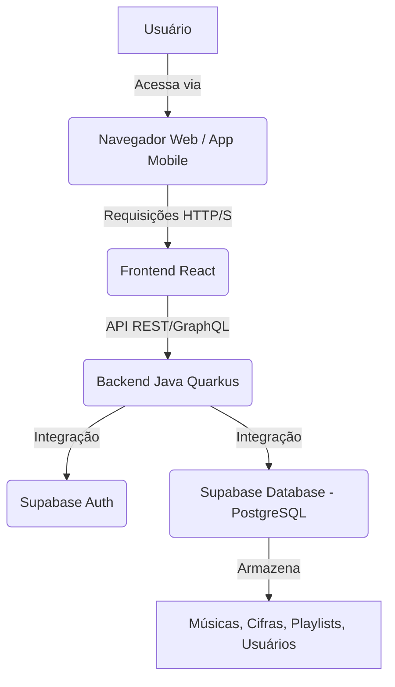

# Documento de Requisitos de Produto (PRD) - Aplicativo de Cifras

## 1. Introdução

Este documento detalha os requisitos para o desenvolvimento de um aplicativo de cifras de violão, projetado para músicos que precisam de uma ferramenta eficiente para gerenciar, transpor e compartilhar cifras. O aplicativo visa resolver os desafios comuns enfrentados por músicos, como a dificuldade de transpor músicas rapidamente, organizar repertórios e colaborar com outros músicos.

## 2. Visão Geral do Produto

O aplicativo será uma plataforma multi-dispositivo (celular, tablet e computador) que permitirá aos usuários armazenar, editar, transpor e visualizar cifras de violão. Ele incluirá funcionalidades para criação de playlists colaborativas e um modo de visualização otimizado para apresentações ao vivo.

## 3. Objetivos do Produto

*   **Eficiência:** Permitir que músicos transponham cifras de forma rápida e precisa.
*   **Organização:** Oferecer uma base de dados robusta para armazenar e gerenciar um grande volume de músicas cifradas.
*   **Colaboração:** Facilitar o compartilhamento de músicas e a criação de playlists colaborativas entre grupos de músicos.
*   **Usabilidade:** Proporcionar uma experiência de usuário intuitiva e adaptável a diferentes dispositivos e cenários de uso (prática, apresentação ao vivo).

## 4. Público-Alvo

Músicos (amadores e profissionais) que tocam violão e precisam de uma ferramenta digital para gerenciar suas cifras, especialmente aqueles que tocam em missas, bares ou outros eventos que exigem adaptação rápida de repertório e tom.

## 5. Requisitos Funcionais

### 5.1. Gerenciamento de Músicas e Cifras

*   **RF001 - Adicionar Músicas:** O usuário deve ser capaz de adicionar novas músicas à base de dados, inserindo o título, artista, letra e cifras.
*   **RF002 - Editar Músicas:** O usuário deve ser capaz de editar informações de músicas existentes (título, artista, letra, cifras).
*   **RF003 - Visualizar Músicas:** O usuário deve ser capaz de visualizar as músicas cifradas de forma clara e legível.
*   **RF004 - Armazenamento de Cifras:** As cifras devem ser armazenadas de forma estruturada, permitindo o ajuste da posição dos acordes nas estrofes das músicas.
*   **RF005 - Busca de Músicas:** O usuário deve ser capaz de buscar músicas por título, artista ou trechos da letra/cifra.

### 5.2. Transposição de Tom

*   **RF006 - Transposição de Tom:** O usuário deve ser capaz de transpor o tom de uma música para cima ou para baixo (meio tom por vez), e o aplicativo deve ajustar automaticamente os acordes.
*   **RF007 - Persistência do Tom:** O tom transposto deve ser salvo para a sessão atual ou opcionalmente persistido para a música.

### 5.3. Playlists

*   **RF008 - Criar Playlists:** O usuário deve ser capaz de criar novas playlists.
*   **RF009 - Adicionar Músicas a Playlists:** O usuário deve ser capaz de adicionar músicas existentes a uma playlist.
*   **RF010 - Reordenar Músicas em Playlists:** O usuário deve ser capaz de reordenar as músicas dentro de uma playlist.
*   **RF011 - Visualizar Playlists:** O usuário deve ser capaz de visualizar as músicas em uma playlist em sequência, como se estivesse virando uma página.

### 5.4. Colaboração e Compartilhamento

*   **RF012 - Compartilhar Músicas:** O usuário deve ser capaz de compartilhar músicas individuais com outros usuários ou grupos.
*   **RF013 - Criar Grupos:** O usuário deve ser capaz de criar grupos de usuários.
*   **RF014 - Compartilhar Playlists Colaborativas:** O usuário deve ser capaz de compartilhar playlists com grupos, permitindo que os membros do grupo editem e adicionem músicas à playlist.

### 5.5. Modo Teatro/Performance

*   **RF015 - Modo Visualização:** O aplicativo deve ter um modo de visualização otimizado para performance (Modo Teatro), exibindo apenas a música e controles essenciais.
*   **RF016 - Controles de Transposição no Modo Teatro:** No Modo Teatro, devem existir botões para transpor o tom para cima e para baixo (meio tom).
*   **RF017 - Navegação no Modo Teatro:** No Modo Teatro, devem existir botões para ir para a próxima música e voltar para a música anterior na playlist.
*   **RF018 - Rolagem Automática:** O Modo Teatro deve incluir uma funcionalidade de rolagem automática da letra/cifra, com velocidade pré-definida e ajustável por música.

### 5.6. Autenticação e Armazenamento

*   **RF019 - Autenticação de Usuário:** O aplicativo deve suportar autenticação de usuário (login/cadastro).
*   **RF020 - Armazenamento de Dados:** Todas as músicas, cifras, playlists e dados de usuário devem ser armazenados de forma segura.

## 6. Requisitos Não Funcionais

*   **RNF001 - Performance:** O aplicativo deve ser responsivo, com tempos de carregamento rápidos para músicas e playlists.
*   **RNF002 - Escalabilidade:** A arquitetura deve ser escalável para suportar um número crescente de usuários e dados.
*   **RNF003 - Segurança:** Os dados do usuário e as informações das músicas devem ser protegidos contra acesso não autorizado.
*   **RNF004 - Compatibilidade:** O aplicativo deve ser compatível com dispositivos móveis (iOS e Android), tablets e navegadores web em computadores.
*   **RNF005 - Usabilidade:** A interface do usuário deve ser intuitiva e fácil de usar para músicos de todos os níveis de proficiência tecnológica.
*   **RNF006 - Manutenibilidade:** O código deve ser bem estruturado, documentado e fácil de manter e estender.

## 7. Arquitetura Proposta

### 7.1. Visão Geral

O aplicativo seguirá uma arquitetura de microsserviços com um frontend desacoplado, utilizando tecnologias modernas para garantir performance, escalabilidade e manutenibilidade.

### 7.2. Componentes Principais

*   **Frontend:** Desenvolvido em **React**, garantindo uma interface de usuário rica e responsiva, compatível com web, mobile (via PWA ou React Native para futuras expansões) e tablets.
*   **Backend:** Implementado com **Java Quarkus**, oferecendo um ambiente de execução leve e rápido para os serviços de API.
*   **Autenticação e Banco de Dados:** Utilização do **Supabase** para gerenciar autenticação de usuários (Auth) e como banco de dados (PostgreSQL).

### 7.3. Diagrama de Arquitetura (Conceitual)

### 7.4. Detalhes Técnicos

*   **Frontend:**
    *   **Framework:** React
    *   **Linguagem:** TypeScript
    *   **Estilização:** TailwindCSS (para agilizar o desenvolvimento e garantir responsividade)
    *   **Gerenciamento de Estado:** Context API ou Redux (a ser definido)
    *   **Comunicação com Backend:** Axios ou Fetch API
*   **Backend:**
    *   **Framework:** Quarkus (Java)
    *   **Linguagem:** Java
    *   **APIs:** RESTful (JSON)
    *   **Segurança:** Integração com Supabase Auth para validação de tokens JWT.
    *   **Acesso a Dados:** Panache ORM (Quarkus) para interação com PostgreSQL via Supabase.
*   **Infraestrutura (Supabase):**
    *   **Autenticação:** Gerenciamento de usuários, registro, login, redefinição de senha.
    *   **Banco de Dados:** PostgreSQL para armazenamento de dados relacionais (músicas, acordes, playlists, usuários, grupos).
    *   **Armazenamento de Arquivos (Opcional):** Supabase Storage para futuras funcionalidades (ex: upload de PDFs de partituras).

## 8. Casos de Uso (Exemplos)

### Caso de Uso 1: Adicionar Nova Música

*   **Ator:** Músico
*   **Pré-condição:** Usuário autenticado.
*   **Fluxo Principal:**
    1.  O músico acessa a tela de 
adição de nova música.
    2.  Preenche os campos: Título, Artista, Letra e Cifras (com marcações para acordes).
    3.  Clica em 'Salvar'.
    4.  O sistema valida os dados e armazena a música na base de dados.
    5.  O sistema exibe uma mensagem de sucesso.
*   **Pós-condição:** A música é adicionada e está disponível para visualização e edição.

### Caso de Uso 2: Transpor Tom de uma Música

*   **Ator:** Músico
*   **Pré-condição:** Usuário autenticado, visualizando uma música cifrada.
*   **Fluxo Principal:**
    1.  O músico está visualizando uma música.
    2.  Clica nos botões 'Tom +' ou 'Tom -'.
    3.  O sistema recalcula os acordes da música para o novo tom (meio tom acima/abaixo).
    4.  A música é exibida com os acordes transpostos.
*   **Pós-condição:** A música é exibida no novo tom.

### Caso de Uso 3: Criar Playlist Colaborativa

*   **Ator:** Músico
*   **Pré-condição:** Usuário autenticado.
*   **Fluxo Principal:**
    1.  O músico acessa a seção de 'Playlists'.
    2.  Clica em 'Criar Nova Playlist'.
    3.  Define o nome da playlist e marca como 'Colaborativa'.
    4.  Adiciona membros ao grupo de colaboração (selecionando usuários existentes).
    5.  Clica em 'Salvar'.
    6.  O sistema cria a playlist e notifica os membros do grupo.
*   **Pós-condição:** A playlist colaborativa é criada e os membros podem adicionar/editar músicas.

### Caso de Uso 4: Usar Modo Teatro

*   **Ator:** Músico
*   **Pré-condição:** Usuário autenticado, visualizando uma playlist.
*   **Fluxo Principal:**
    1.  O músico seleciona uma playlist e clica em 'Iniciar Modo Teatro'.
    2.  O aplicativo entra em modo de tela cheia, exibindo a primeira música da playlist.
    3.  A rolagem automática da música inicia com a velocidade pré-definida.
    4.  O músico pode usar os botões de transposição de tom ('Tom + / Tom -') para ajustar o tom da música atual.
    5.  O músico pode usar os botões de navegação ('Próxima / Anterior') para mudar de música na playlist.
*   **Pós-condição:** O músico consegue performar usando a playlist com as funcionalidades de transposição e rolagem automática.

## 9. Tecnologias Propostas

*   **Frontend:** React, TypeScript, TailwindCSS
*   **Backend:** Java Quarkus
*   **Banco de Dados e Autenticação:** Supabase (PostgreSQL, Auth)

## 10. Próximos Passos

1.  Validação e refinamento deste PRD com as partes interessadas.
2.  Criação do backlog de desenvolvimento (épicos, histórias de usuário).
3.  Configuração do ambiente de desenvolvimento e inicialização dos projetos frontend e backend.
4.  Desenvolvimento iterativo das funcionalidades, priorizando os requisitos essenciais.

## 11. Referências

*   [React Official Website](https://react.dev/) - Biblioteca JavaScript para construir interfaces de usuário.
*   [Quarkus Official Website](https://quarkus.io/) - Framework Java nativo para Kubernetes, otimizado para GraalVM e OpenJDK HotSpot.
*   [Supabase Official Website](https://supabase.com/) - Alternativa open source ao Firebase, oferecendo banco de dados PostgreSQL, autenticação, APIs instantâneas e armazenamento.
